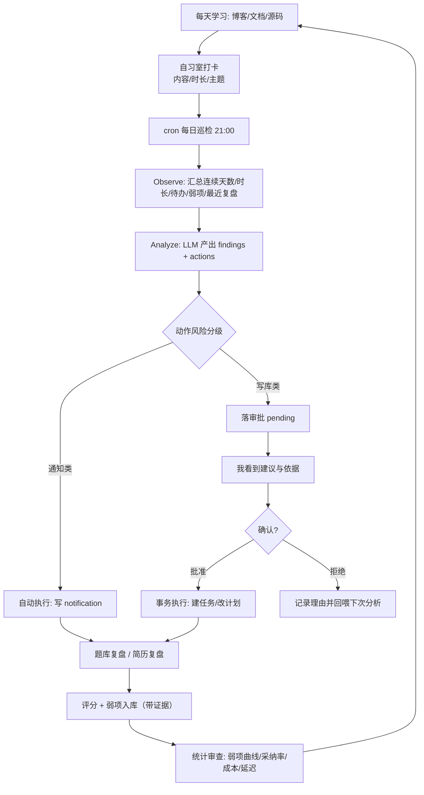
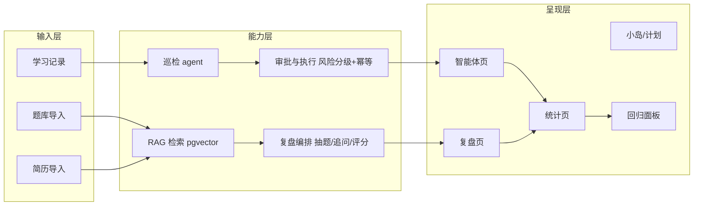
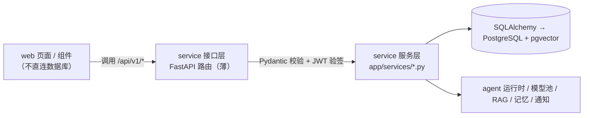

# Summer Checkin - 产品需求文档 (PRD)

---

# 0. 文档信息

## 0.1 文档状态

- **当前版本**: `3.1.1（开发交付稿）`
- **当前阶段**: 开发中（双服务骨架开工）
- **创建人**: 项目所有者（本人）
- **创建日期**: `2026-09-25`
- **最后更新**: `2026-09-25`
- **核心干系人**: 产品 / 研发 / 测试：本人；协作者：AI（本文档即其执行规范）
- **目标工程**: `summer-checkin/`（monorepo：`web/` = Next.js 页面与登录，`service/` = FastAPI 领域服务，`infra/` = nginx 与编排，`docs/` = 文档）
- **架构决策**: `tech/decisions/ADR-001-domain-service.md`（后端服务化）、`tech/architecture.md`（服务边界与约定）
- **参考项目**: `summer-checkin-master/`（原始项目副本，**只读参考**：27 张表 / 28 个 API 路由 / 15 个页面 / 约 2.6 万行手写代码，已部署在阿里云 ECS，无 git 历史）

## 0.2 更新记录

> 方案迭代全部发生在 2026-09-25 的连续讨论中，保留记录是为了让"为什么否掉前几条路线"这个判断可追溯。

| 版本号 | 版本状态 | 更新人 | 更新日期 | 核心更新内容 |
|---|---|---|---|---|
| 0.1.0 | 方向初稿 | 本人 | 2026-09-25 | 换域为"面试对练台"：角色卡、rubric 证据化评分、语音对练 |
| 0.2.0 | 方案评审稿 | 本人 | 2026-09-25 | 契约优先：Python 领域服务独占数据，Web / exe / Android 共用契约 |
| 0.3.0 | 方案评审稿 | 本人 | 2026-09-25 | 改回增量路线：域不变，加简历复盘与题库，补系统能力 |
| 1.0.0 | 需求初稿 | 本人 | 2026-09-25 | 按 PRD 模板重写全文：明确用户、痛点、范围、验收 |
| 2.0.0 | 方案评审稿 | 本人 | 2026-09-25 | 补"实际"部分：**项目来源与迁移策略（R000 骨架搭建）**、现状与差距、方案先行（分层与数据结构）、字段级数据模型、接口清单、默认值与常量、验收标准与测试方案 |
| 2.1.0 | 开发交付稿 | 本人 | 2026-09-25 | 评审答复落地：题库来源改为"**外部题目集导入 + 清洗 + RAG**"（首版主题：Agent 应用开发 / 后端知识）；工程落在 `summer-checkin/`、master 转为只读参考；聊天室隐藏入口；巡检时间、审批时效、保留期定稿 |
| **3.0.0** | **开发交付稿** | 本人 | 2026-09-25 | **架构改为双服务**：FastAPI 拥有数据库 schema 与全部业务接口，Next 只做页面与认证（BFF + 短期 JWT），Prisma 退场、Alembic 唯一迁移；工期由 2 周调整为 2–3 周分期（见 4.1） |
| **3.1.0** | **开发交付稿** | 本人 | 2026-09-25 | **划清 R000 边界**（新增 3.0.3）：R000 只搬页面、建数据基线、做模型池**最小切片**与骨架接口；agent 运行时（R001–R003）、RAG 与 embedding（R005）、记忆抽取（R006–R007）、题库清洗、eval（R010）按需求推进，不做全量移植 |
| **3.1.1** | **开发交付稿** | 本人 | 2026-09-27 | **需求到任务的衔接改由 Trellis 承接**：1.6 每个需求增加"初步拆解"列（原 `docs/tasks/` 的拆解要点并入）；取消 `docs/tasks/` 任务 PRD 层，任务级选型与详细设计改在 `.trellis/tasks/*/design.md` 里谈；2.6、3.0、3.3 的引用同步改指 |

**作废结论**：0.1.0 需 8 张新表 + 语音链路（8–12 周）；0.2.0 需重写后端（4–6 周，为"多端"这一低频价值付费）。1.0.0 起改为增量路线：**约 2 周，新增 3 张表、2 处加列**。

## 0.3 相关文档

| 文档 | 位置 |
|---|---|
| 原始项目说明书 | `summer-checkin-master/README.md` |
| 现有数据模型 | `summer-checkin-master/prisma/schema.prisma` |
| 现有 CI 流水线 | `summer-checkin-master/.github/workflows/ci.yml` |
| 页面与接口现状 | `summer-checkin-master/src/app/**`（15 个 page.tsx / 28 个 route.ts） |
| 本文档编写规范 | [VibeVibe 3.0 PRD 模板](https://www.vibevibe.cn/Advanced/03-prd-doc-driven/00-prd-template.html) |

## 0.4 名词解释

| 术语 | 解释 |
|---|---|
| **巡检（Run）** | agent 定时读取学习数据后产出一组结论与建议的过程，每次落一条 `agentrun` 记录 |
| **审批边界** | 哪些 agent 动作自动执行、哪些必须用户确认后才执行的分界线（本项目核心设计之一） |
| **弱项（Weakness）** | 复盘中提取的、带证据（日期 + 原话/原题）的知识或表达缺口，跨轮次累积 |
| **骨架（R000）** | 本项目的第一个需求：把原项目迁移并重构为分层工程模板，只搭页面与服务骨架，不含业务任务 |
| **八股文** | 面试中反复被问的技术基础知识问答，本项目中作为题库复盘的素材 |
| **RAG** | 先用向量检索找出相关资料再让模型回答；本项目用于题库与简历检索 |
| **Trace（轨迹）** | 一次 agent 运行的完整记录：步骤、工具调用、决策与理由、成本与耗时 |
| **Fixture（固化样本）** | 把一条真实 trace 冻结成 JSON，用于改动后在离线环境重放对比 |
| **幂等键** | 用于保证重复请求不产生重复副作用的标识；本项目审批靠状态机条件更新的原子性，工具执行复用 `agenttoolcall.idempotency_key` |

## 0.5 需求确认结果（AI 复述 + 已答复）

> 按"主动确认"原则，以下是我对需求的理解，已逐条与你确认（答复见本节第 5 点）。**后续如与本文档不一致，以本文档为准。**

**1. 目标用户**：像你一样的开发者——持续在读技术博客/文档/源码，但没有系统复盘习惯；平时不看八股，面试前才突击；简历里的项目写过一次就没再整理。第二个用户群体是转行/自学的求职者。非用户：需要协作与分享的团队场景。

**2. 核心功能（5 个）**：
1. 自习室打卡与学习记录（已有，改造）
2. 每日巡检：agent 读完前一天数据后给一条**有依据**的建议，写库类动作必须你确认
3. 题库与学习复盘：导入外部题目集（清洗为结构化题目），抽题 → 作答 → 评分 → 弱项入库
4. 简历复盘：导入简历 → 逐条项目三层追问 → 评分 → 弱项入库
5. 统计审查：学习 / 复盘 / agent 质量（采纳率、成本、延迟）三视图

**3. 不做的事**：换域成面试对练台、重写后端与多端、语音、题库内容生产、社区与协作、支付、移动端 App、3D 岛与聊天室新功能。

**4. 我认为你还没考虑到的点（可能的问题）**：
1. **第一天没有数据时产品是空的**——新用户看到空统计页会立刻流失，需要"冷启动路径"（首日引导 + 用今天的打卡当场生成第一条建议）。
2. **复盘评分会飘**——同一份作答两次评分可能差 1–2 分；若不处理，"弱项曲线"会抖动成噪声，需要一个稳定性口径（见 3.11 验收 R006）。
3. **题库第一批内容是空的**——题目要靠导入才有内容，首版先用 mock 题目跑通链路，再由你导入 GitHub 题目集。
4. **写库类建议一天最多 1 条**——否则审批会变成负担，用户会开始盲点"批准"，审批形同虚设。
5. **成本会随使用上涨**——巡检 + 复盘 + 简历追问三条链路都在烧 token，必须有每日上限与降级。
6. **数据保留策略未定**——复盘记录与 trace 会持续增长，需要明确的保留期与归档口径。

**5. 待确认问题与答复（已确认，2026-09-25）**：

| # | 问题 | 答复 | 落地影响 |
|---|---|---|---|
| Q1 | 首发题库主题 | **Agent 应用开发、后端知识**。题目由你自己从 GitHub 找好的导入，**真正的工作量在文档清洗与 RAG 基础设施**；主题先定好只是方便先 mock 数据 | 3.3 改为"导入 + 清洗 + 检索"管线；首批用 mock 题目跑通链路 |
| Q2 | 每日巡检时间 | **21:00** | 写入 3.9 默认值 |
| Q3 | 写库类建议是否当日过期作废 | **是** | 审批增加时效规则，过期自动作废并记一条 `expired` |
| Q4 | 复盘与 trace 保留期 | **明细 90 天、聚合指标永久** | 写入 3.9，清理任务按此实现 |
| Q5 | 3D 岛与聊天室 | **3D 岛保留；聊天室不开放，隐藏入口即可** | 从 `top-nav.tsx` 移除 `<ChatRoom />`，代码全部保留，配置一行可恢复 |
| Q6 | 工程目录 | **在 `summer-checkin/` 完成**，`summer-checkin-master/` 作为参考项目便于实时读取 | 1.8 改为"新建到 `summer-checkin/` + 从 master 搬运"，`git init` 在 `summer-checkin/` |

---

# 一、 需求背景与目标

## 1.1 项目概述

> 一个给"想持续学技术、但缺乏系统复盘"的开发者用的学习平台：**每天在自习室打卡学习 → agent 根据前一天的数据给出建议 → 用题库做学习复盘、把学到的讲出来 → 统计面板审查进度与弱项 → 用简历复盘验证"我到底讲不讲得清"。**

三句限定：自用为主（不是社区）、单人（不做协作与分享）、桌面 Web（不做 App）。

## 1.2 要解决的核心问题 (Problem Statement)

- **目标用户画像**
  1. **主用户：工作 0–5 年的开发者，也包括我自己**。每天会读技术博客、文档、源码，学习是持续的，但**学习过程没有沉淀结构**；面试季才集中看八股文；简历里的项目只写过一次，没有二次整理。
  2. **次用户：转行 / 自学的求职者**。有明确学习目标，但缺节奏与反馈，最容易卡在"学了但不知道自己会不会"。
  3. **非用户**：需要协作、分享、班级管理的场景。

- **用户场景 (Scenario)**
  - 平日 21:00–23:00，在电脑前学完一段内容，想记录并顺手复习。
  - 周末下午，想看"这一周学的东西有没有留下来"。
  - 面试前 1–2 周，想知道"我的项目能不能讲清楚、八股文到底记住了多少"。

- **核心痛点 (Pain Point)**
  1. **学了不沉淀**：每天看博客/文档，看完即忘，知识碎片化，无法积累成可复用的资产。
  2. **复盘没有节奏**：只有"该复盘了"的念头，没有触发机制和载体；复盘靠心情，不靠流程。
  3. **只在面试前突击**：八股文平时不看不练，面试前集中背，记不牢、用不上。
  4. **项目讲不清**：项目只写进简历一次，没有二次整理与追问演练，面试时说不清取舍与数字。

## 1.3 用户故事 (User Stories)

- **故事一**：作为一名**日常学习但从不复盘的开发者**，我想要**每天花两分钟记录今天学了什么**，以便于**一周后还能说出这周学了什么**。
- **故事二**：作为一名**没有复盘节奏的人**，我想要**系统每天主动给我一条基于真实数据的建议**，以便于**不用靠自制力决定今天该补哪里**。
- **故事三**：作为一名**只在面试前才看八股文的人**，我想要**平时就能用题库做小规模复盘并看到正确率**，以便于**面试前不是从零开始**。
- **故事四**：作为一名**简历里写了项目但讲不清楚的求职者**，我想要**系统逐条追问我的项目并指出我答不清的地方**，以便于**面试前知道自己会在哪里翻车**。
- **故事五**：作为一名**在调整 agent prompt 的人**，我想要**看到改动前后的工具选择、建议采纳率、成本与延迟对比**，以便于**确认这次改动真的变好了**。

## 1.4 项目目标与价值

- **用户价值**：把"被动消费内容"变成"有节奏的学习 → 复盘 → 验证"闭环。
- **商业价值**：本项目直接价值是**作为求职作品**（真实使用数据 + 技术判断力的证据）；本期不为此做任何增长功能。
- **项目目标 (SMART)**
  - **S**：公网 HTTPS 可访问；我自己每天真实使用，形成稳定闭环。
  - **M**：连续使用 ≥ 14 天；≥ 30 次巡检；≥ 10 次题库复盘；≥ 5 次简历复盘；建议采纳率 ≥ 30%；单次巡检成本与 P95 延迟成文可查。
  - **A**：基于现有系统增量开发，新增 3 张表、2 处加列，工期约 2 周。
  - **R**：与"用真实数据证明 agent 质量与工程判断"的求职目标一致。
  - **T**：评审通过后 3 周内上线并开始积累数据。

## 1.5 需求范围

- **In-Scope**
  1. **双服务骨架（R000，第一优先）**：`service/`（FastAPI + SQLAlchemy + Alembic + JWT 验签）、`web/`（页面与登录跑通）、`infra/`（nginx 分流与编排）
  2. 自习室打卡与学习记录（改造）
  3. 每日巡检与可解释建议
  4. 审批边界与幂等
  5. 题库与学习复盘（外部题目集导入 + 清洗 + 检索抽题）
  6. 简历复盘
  7. 统计审查面板与成本账本
  8. Agent 行为回归面板
  9. HTTPS + 域名部署
  10. 演示材料（脚本、简历表述、问答）

- **Out-of-Scope**
  1. 换域成"面试对练台"（角色卡 / 语音对练）
  2. 重写后端为独立服务、多端互通（exe / Android / 小程序）
  3. 题库内容的大规模生产（只做导入 + 生成 + 检索）
  4. 多人协作、分享、社区、排行榜
  5. 支付、会员、配额计费
  6. 移动端适配与 App
  7. 聊天室开放（本期隐藏入口，代码保留不删）；3D 岛保留不动，不投入新功能
  8. 音视频类学习内容

## 1.6 需求列表 (Requirements List)

> **"初步拆解"这一列是每个需求的起点想法**，写到"大概要做哪几件事"为止。真正的技术选型、被否方案、工期拆分不在这里——每个需求开工前开一个 Trellis 任务，在那里谈透（见 2.6 与 `docs/README.md` §3）。

| 需求ID | 模块 | 需求描述 | 初步拆解（开工前的起点，不是设计） | 优先级 | 状态 | 备注 |
|---|---|---|---|---|---|---|
| **R000** | **双服务骨架** | **`service/`（FastAPI + SQLAlchemy + Alembic 从零建 31 张表 + JWT 验签 + 统一响应与错误 + CI）、`web/`（页面与登录跑通、一条真实链路调通）、`infra/`（两个 Dockerfile + compose + nginx 分流）；不含业务逻辑** | 仓库结构、两个 Dockerfile、nginx 分流、JWT 传递、31 张表迁移基线、模型池最小切片 | **高** | 开发中 | 一切需求的前提 |
| R001 | 审批边界 | 写库类 agent 动作必须先落审批，确认后在事务内执行；通知类自动执行 | 运行时四步重写、风险分级、审批条件更新、通知出口、`execute_action` 调用点守卫 | 高 | 规划中 | 修复现状缺陷 |
| R002 | 幂等 | 审批与工具执行支持幂等，重复触发不产生重复副作用 | 工具幂等键、巡检 `(user_id, 日期, 动作类型)`、并发批准 | 高 | 规划中 | 复用 `idempotency_key` |
| R003 | 每日建议 | 建议必须带依据，一天 ≤ 3 条（写库类 ≤ 1 条），含禁用话术校验与规则降级 | 建议依据结构、条数上限、禁用话术校验、规则降级 | 高 | 规划中 | |
| R004 | 题库复盘 | 按主题抽题 → 作答 → 评分 → 弱项入库；首版主题：Agent 应用开发 / 后端知识 | 抽题策略、评分四维与证据、弱项入库 | 高 | 规划中 | 首批用 mock 题目 |
| R005 | 题库导入与清洗 | 导入外部题目集（md / txt / pdf / docx）→ 清洗为结构化题目 → 入库可检索 | **清洗管线 5 步、切块策略、1024 维向量、pgvector 检索、精排、阈值**（最需要谈选型的一个） | 高 | 规划中 | 难点在清洗与 RAG |
| R006 | 简历复盘 | 导入简历 → 抽取项目 → 三层追问 → 评分 → 弱项入库 | 项目抽取、L1/L2/L3 追问、卡层收尾、评分证据 | 高 | 规划中 | 评分必须挂证据 |
| R007 | 弱项档案 | 弱项带证据跨轮次累积，可标记已纠正 | 合并阈值 0.88、纠正闭环、曲线口径 | 中 | 规划中 | 复用 `usermemory` |
| R008 | 统计面板 | 学习 / 复盘 / agent 质量三视图 | 三视图口径、聚合查询、空态 | 中 | 规划中 | |
| R009 | 成本账本 | `tokenusage` 归因到 run / 复盘，页面可查 | `run_id` 归因、单价表、突增告警 | 中 | 规划中 | 加 `run_id` 列 |
| R010 | 回归面板 | fixture 固化 + 重放 + 五项指标对比 + CI 门禁 | fixture 格式、重放、五指标、CI 门禁 | 中 | 规划中 | 差异化能力，永不砍 |
| R011 | 部署上线 | HTTPS + 域名，链接可公开访问 | HTTPS、域名、灰度与回滚 | 中 | 规划中 | |
| R012 | 演示材料 | 60 秒脚本 + 简历三句 + 问答卡 | 60 秒脚本、简历三句、问答卡 | 中 | 规划中 | 直接交付物 |
| R013 | 移动端 | 手机浏览器适配 | — | 低 | 不做 | V2 考虑 |
| R014 | 多端 | exe / Android 客户端 | — | 低 | 不做 | 若做需先拆领域服务 |

**状态口径**：规划中（未开 Trellis 任务）→ 设计中（任务已创建、`design.md` 在写）→ 开发中（`task.py start` 后）→ 已完成（任务已归档）。

## 1.7 现状盘点与差距（As-Is → To-Be）

| 维度 | 现状（As-Is） | 本期目标（To-Be） | 差距 |
|---|---|---|---|
| 页面 | 15 个 page.tsx，功能完整 | 6 个主路由 + 2 个新页面（复盘、回归面板）能渲染空态 | 新增 2 页，其余改造入口与文案 |
| 接口 | 28 个 route.ts，与页面同进程、多为直连 Prisma 的附带接口 | 全部业务接口由 `service/`（FastAPI）提供 `/api/v1/*`，web 只保留认证路由 | **需整体迁到 Python 服务（R000 起）** |
| 数据模型 | 27 张表定义在 `prisma/schema.prisma` 中 | **31 张表**由 SQLAlchemy 模型 + Alembic 迁移接管（Prisma 退场） | 需重建模型与迁移基线 |
| agent | Observe→Analyze→Plan→Execute 已落库，有审批与决策表 | 审批按风险分级、建议带依据、成本归因、回归门禁 | 现状 `CREATE_TASK` 直接写库，审批未真正生效 |
| 学习记录 | 打卡有 content/hours/subject/mood | 增加"今日学了什么 + 主题"，与题库主题对齐 | 字段复用，语义扩展 |
| 复盘能力 | 无 | 题库复盘 + 简历复盘 + 弱项曲线 | **全部新增** |
| 可观测 | 有 `tokenusage`（无 run 归因），步骤有起止时间 | 成本按 run 归因、P95 延迟可查、回归可对比 | 加 1 列 + 1 张对比表族 |
| 聊天室与 3D 岛 | 聊天室常驻悬浮入口（`top-nav.tsx` 渲染 `<ChatRoom />`）+ WS sidecar；3D 岛在首页 | 聊天室隐藏入口（代码保留），3D 岛保留 | 各 1 处改动，不投入新功能 |
| 部署 | Docker + nginx + 阿里云 ECS，HTTP | HTTPS + 域名 | roadmap 旧事，本期必做 |
| 版本管理 | **无 git 仓库** | 仓库已 `git init`（`master`），按需求 ID 提交 | 已补，工程基线提交见 R000 |

## 1.8 项目来源与迁移策略（本期第一件事）

**来源**：本项目不是从零新建，而是**基于原始项目 `summer-checkin-master/` 迁移与重构**。原始项目是已完成的自习室平台（打卡、计划、专注、聊天室、知识库、agent），已部署上线，具备真实数据。

**目录约定（已确认）**

| 角色 | 目录 | 规则 |
|---|---|---|
| 目标工程 | `summer-checkin/` | monorepo：`web/`（Next.js 页面与登录）、`service/`（FastAPI 领域服务）、`infra/`（nginx 与编排）、`docs/`（文档）；`git init` 也在这里 |
| 参考项目 | `summer-checkin-master/` | **只读**：作为搬运来源与对照参考，随时可读，不做任何修改 |
| 文档 | `summer-checkin/docs/` | 产品文档 `PRD.md` + 技术文档 `tech/` |

**迁移目标**：先得到一套**可运行的双服务骨架**（`service/` 后端服务 + `web/` 前端页面 + `infra/` 编排），业务需求（R001–R012）之后按服务边界往里填。这一步的价值是：后续每个需求只写"填什么"，而不是每次重新决定"放哪个服务、放哪一层"。

**迁移方式**：在 `summer-checkin/` 新建 monorepo。前端从 `summer-checkin-master/` 搬运页面与组件，把"直连数据库"改为"调 `/api/v1/*`"；后端按 `tech/architecture.md` 的分层**用 Python 重写**（agent 运行时、模型池、记忆、通知、RAG 调用、记账）。`git init` 后**首个提交是文档与工程基线**（`docs/` + 配置），`web/` 与 `service/` 建出来后提交骨架快照，之后按需求 ID 逐步提交。

**四类处置清单**

| 类别 | 内容 | 处置 | 阶段 |
|---|---|---|---|
| **搬运（改调用方式）** | UI 组件（`components/ui/*`）、统计与热力图组件、Markdown 渲染、页面与交互、`scripts/extract_pdf.py` / `extract_docx.py`、nginx 与 Dockerfile 参考 | 复制到 `web/`，把数据请求从"直连数据库"改为"调 `/api/v1/*`" | **R000 全搬**（页面可打开、空态可渲染） |
| **重建（数据基线）** | 原 27 张表定义 → 31 张 SQLAlchemy 模型 + Alembic 首个迁移（含 `vector(1024)` 列与 HNSW 索引） | 在 `service/` 重建，不接管旧库 | **R000** |
| **重写（Python 服务，按需求推进）** | agent 运行时（参考项目 `lib/agent/runtime.ts` 886 行）、模型池、长期记忆、通知、RAG 调用与题库清洗、token 记账、全部业务接口 | 在 `service/` 用 FastAPI + SQLAlchemy 重写；保留"写库动作必须审批"的边界（原实现 `CREATE_TASK` 直接写库是已知缺陷） | **R000 只做模型池最小切片 + 接口骨架**；运行时 R001–R003；RAG 与 embedding R005；记忆 R006–R007 |
| **改造（后续需求）** | 打卡字段与主题、巡检建议规则、审批风险分级、成本归因、统计视图 | R001–R009 | 后续需求 |
| **不搬运** | Prisma（schema 与迁移）、聊天室页面与 WS sidecar（`server/`）、TS 版 agent 运行时与模型池 | 见 `tech/decisions/ADR-001-domain-service.md` 与 `ADR-002-no-chatroom.md` | — |

**迁移验收**：仓库已就绪且工程基线提交在案；`web/` 与 `service/` 各自检查全绿（`npm run check` / `ruff check` + `pytest`）；`docker compose up` 能在空环境起出四个容器并经 nginx 访问；浏览器能打开页面并完成登录；`GET /api/v1/meta` 返回统一结构；`alembic upgrade head` 能在空库建出 31 张业务表。

---

# 二、 方案概述

## 2.1 核心业务流程图 (Business Flow)



**图注**：四条关键边——① 学习数据→巡检；② 巡检→审批（写库动作必须经人）；③ 复盘→弱项档案；④ 审查→下一轮学习。任何一条断掉，产品就退化为"打卡工具 + 聊天机器人"。

## 2.2 核心功能流程图 (Function Flow)



## 2.3 信息架构图 (IA)

```
Summer Checkin
├── 小岛（今日打卡）· 打卡表单 / 连续天数 / 年度热力图 / 场景与 3D 岛（保留不改）
├── 计划 · 计划列表与详情 / 任务（科目）/ 文档工作室
├── 阅读（资料库）· 我的笔记 / 面经 / 题库（自带 + 导入）/ 知识库检索
├── 复盘（新增入口）· 题库复盘 / 简历复盘
├── 智能体（/agent）· 教练总览（建议 + 审批）/ 决策时间线 / 成本与延迟 / 回归面板
├── 主页（统计）· 学习 / 复盘 / agent 质量
└── 全局 · 通知铃 / 聊天室（保留）/ 个人资料 / 引导
```

## 2.4 技术方案（方案先行）：分层与数据结构

> 按"方案先行"原则，先定结构再写代码。R000 就是把这一层搭出来。

### 2.4.1 分层（唯一的数据通路）



**硬规则（写进 lint 与 review 清单）**

1. **web 不直连业务库**：页面与组件只能通过 `/api/v1/*` 取数（Prisma 已退场）；web 侧只保留 Better Auth 需要的认证表读写。
2. 接口层只做四件事：解析 → Pydantic 校验 → JWT 验签 → 调服务层并包装响应。**不写业务规则**。
3. 服务层按域一文件，对外只暴露函数；业务规则、事务、幂等都在这一层。
4. **schema 由 Alembic 唯一拥有**：建表改表只改 `service/alembic`，web 侧不得出现第二份 schema。
5. 所有写接口接受 `Idempotency-Key` 头；审批幂等靠 `agentapproval.status` 条件更新（`WHERE status='pending'`）的原子性，工具执行复用 `agenttoolcall.idempotency_key` 唯一约束。

> 详细版（服务边界判据、认证链路、目录、部署拓扑）见 `tech/architecture.md`；决策理由见 `tech/decisions/ADR-001-domain-service.md`。

### 2.4.2 统一响应与错误码

- 成功：`{ "data": ... }`；列表：`{ "data": [...], "meta": { "nextCursor": "..." } }`
- 失败：`{ "error": { "code": "...", "message": "...", "requestId": "..." } }`
- 错误码（前端按码分支，文案可改）：`AUTH_REQUIRED` / `FORBIDDEN` / `NOT_FOUND` / `VALIDATION_FAILED` / `CONFLICT` / `RATE_LIMITED` / `QUOTA_EXCEEDED` / `UPSTREAM_FAILED` / `INTERNAL`
- 每个请求带 `X-Request-Id`（无则生成），日志与响应都带上。

### 2.4.3 数据结构（PRD 只描述"需要什么数据"，字段级定义见 3.7）

| 需求 | 需要的数据 | 落点 |
|---|---|---|
| 打卡与主题 | 日期、时长、学了什么、主题 | 复用 `checkin` |
| 巡检与建议 | 一次运行的步骤、工具调用、结论、建议、决策与理由、成本 | 复用 `agentrun` / `agentstep` / `agenttoolcall` / `agentapproval` / `agentdecision`；`agentrun` 加 `model`、`prompt_version` |
| 题库 | 题目文本、主题、答案要点、向量 | 复用 `knowledgedoc` / `documentchunk` |
| 复盘会话 | 会话、逐条问答、评分与证据、弱项 | 复用 `conversation` / `conversationmessage` / `usermemory` |
| 成本 | 每次调用的 tokens 与归属 | 复用 `tokenusage` + 加 `run_id` |
| 回归 | 固化样本、一次重放、逐条对比 | **新增 3 张表** |

## 2.5 页面/组件职责、实现思路与技术难点

| 页面 | 职责 | 复用 / 新增 | 实现思路 |
|---|---|---|---|
| 小岛 | 打卡与连续性 | 复用为主 | 表单加"主题"字段，其余不动 |
| 计划 | 计划与科目 | 复用 | 任务来源增加"复盘生成的补强任务" |
| 阅读/资料库 | 题库与资料 | 复用 + 扩展 | 题库 = `knowledgedoc` 的一种 `source_type`，上传管线不变 |
| 复盘（新） | 题库复盘 + 简历复盘 | **新增** | 一个页面两个标签页，共用"问答卡片 + 评分卡"组件 |
| 智能体 | 建议、审批、时间线、成本 | 复用 + 扩展 | 时间线已有，新增审批卡片与成本面板 |
| 统计 | 三视图 | 复用 + 扩展 | 复用自绘图表组件（无第三方图表库） |
| 回归面板（新） | fixture 与对比报告 | **新增** | 子路由 `/agent/eval`，表格 + diff 展示 |
| 聊天室 | 隐藏入口 | 改 1 处 | 从 `top-nav.tsx` 移除 `<ChatRoom />`，代码保留、配置一行可恢复；若 WS sidecar 仅服务聊天室，部署时可暂不启动 |

**技术难点与对策**

| 难点 | 风险 | 对策 |
|---|---|---|
| 巡检幂等 | cron 重跑或手动重跑会重复建议与重复执行 | 以 `(user_id, 日期, 动作类型)` 作为幂等键，落 `agenttoolcall.idempotency_key` 唯一约束 |
| 审批并发 | 两个标签页同时点"批准"导致重复建任务 | 状态机条件更新（`pending → approved` 只成功一次），冲突返回 `CONFLICT` |
| 评分可追溯 | LLM 打分飘、无法解释 | 每个维度分必须挂证据句；挂不上判 `invalid` 并重跑一次；两次失败记"无结论" |
| 回归可复现 | 模型非确定性导致对比噪声 | fixture 固化输入 + 记录 `model` / `prompt_version`；指标用均值与阈值，而非单次等值比较 |
| 页面直连库 | 改造成接口化时容易漏 | lint 规则 + 迁移清单逐页勾选 |

---

## 2.6 核心子系统与技术路线（点一下，详细设计在任务里）

> 这一节的作用是**让总 PRD 不出现"某个子系统从没提过"的空白**。这里只点明：有哪些子系统、各自归哪个需求、参考实现是什么、详细设计写在哪。
> 具体技术选型与设计**不在总 PRD 展开**——每个需求开工前开一个 Trellis 任务，在 `.trellis/tasks/*/design.md` 里谈透（怎么开任务见 `AGENTS.md` 的"任务入口"）。

| 子系统 | 是什么 | 参考实现 | 归属需求 | 详细设计在哪 |
|---|---|---|---|---|
| **agent 运行时** | Observe → Analyze → Plan → Execute 四步：读学习数据、LLM 出结论与建议、按风险分级、写库类必须审批后才执行 | `src/lib/agent/runtime.ts`（886 行，**已知审批未生效**） | R001–R003 | `tech/backend.md` §3 + R001 任务的 `design.md` |
| **模型池** | 档位链（HIGH/LOW）、免费额度轮换、限流冷却、token 记账与限额 | `src/lib/model-pool.ts`（587 行） | R000 最小切片 → R001 完整 | `tech/integrations.md` §2 |
| **知识服务（RAG）** | 资料/题目集清洗 → 切块 → 1024 维向量 → pgvector 检索 → 精排 → 进上下文 | `src/lib/rag/retriever.ts`、`knowledge-upload.ts`、`scripts/extract_*.py` | R005（消费方 R004 / R006） | `tech/integrations.md` §3 + R005 任务的 `design.md` |
| **长期记忆 / 弱项档案** | 从作答中抽取弱项，向量相似度合并（≥ 0.88），支持"已纠正"闭环 | `src/lib/memory.ts`（469 行） | R006–R007 | `tech/backend.md` §2.2 + R007 任务的 `design.md` |
| **通知** | 巡检建议的出口；同类型同日节流去重 | `src/lib/notification.ts`（183 行） | R001 | `tech/backend.md` §2.2 |
| **认证与 BFF** | Better Auth 留在 web，签发 15 分钟 JWT；service 只验签，不碰认证表 | `src/lib/auth.ts`、`auth-client.ts` | R000 | `tech/architecture.md` §3 |
| **评测与回归** | fixture 固化真实 trace → 离线重放 → 五项指标对比 → CI 门禁 | 无（本期新增） | R010 | `tech/integrations.md` §7 + R010 任务的 `design.md` |
| **统计与成本** | 学习 / 复盘 / agent 质量三视图；tokens × 单价按 run 归因 | `src/lib/study-stats.ts`、`usage.ts` | R008–R009 | `tech/api/06-stats-eval.md` |

**关于 agent 设计：不是复制原实现，而是按行为重写。** 参考实现要**读**（缺陷都在里面），但有三个已知问题必须在重写时修掉，不能带过来：

1. **审批只是展示品**：`runtime.ts` 第 741–763 行写 `agentapproval(status='pending')`，第 766 行起却**无条件执行全部动作**，`CREATE_TASK` 直接写 `plantask`——这正是 R001 要修的边界；
2. **决策状态自相矛盾**：`agentdecision.status` 恒为 `pending`，但 `action` 里又记 `executed: true`，导致"建议采纳率"算不出来（R009 依赖它）；
3. **Observe 不读弱项与复盘**：只读打卡/计划/待办，复盘闭环接不上（R007 依赖它）。

**为什么总 PRD 只写到这个粒度**：这四步的输入输出、超时、降级阶梯一旦展开就是几十行，而它会随实现反复调整——放在总 PRD 里会让需求文档跟着技术细节抖动。展开版见 `tech/backend.md` §3，实现方案在 R001 的 Trellis 任务（`design.md`）里定。

---

# 三、 细节方案

## 3.0 功能详述：R000 双服务骨架（第一优先，不含业务逻辑）

**目标**：在 `summer-checkin/` 立起两个能跑的空壳——`service/` 提供统一结构的接口并能连库，`web/` 能打开页面并完成登录，nginx 在同一域名下分流。业务逻辑留给 R001 之后；搬运来源是只读的 `summer-checkin-master/`。

**唯一的横切例外**：模型池的**最小切片**（档位链 + 失败降级 + 记账）在 R000 就要能用——因为 `/meta` 要暴露限额、W2 一开工就要用，而且它可以用假 client 单测、不依赖真实 key。**RAG 检索、agent 运行时、记忆抽取、通知、题库清洗都不在 R000**（见 3.0.3）。R000 结束时页面能打开、数据是空的——这是预期，不是缺陷。

**3.0.1 交付物与验收**

| 交付物 | 内容 | 验收方式 |
|---|---|---|
| 仓库骨架 | monorepo（仓库已存在，`git init` 无需再做）：`web/`、`service/`、`infra/`、`docs/` | 工程基线提交；两端各自检查全绿 |
| 后端骨架 | `service/`：FastAPI 应用装配、`app/core`（config / JWT 验签 / response / errors / logging）、`app/api/v1`（薄接口层）、`app/models`（**31 张表**）、`app/services`（按域建文件，先返回空数据） | `ruff check` + `pytest` 全绿；`/api/v1/healthz`、`/api/v1/meta` 返回统一结构 |
| 数据基线 | SQLAlchemy 模型 + Alembic 初始迁移（含 pgvector 扩展与 HNSW 索引） | `alembic upgrade head` 在空库建出 **31 张业务表**（+ `alembic_version`）；`alembic check` 无漂移 |
| 认证打通 | Better Auth 留在 `web/` 并签发短期 JWT；`service/` 验签取 `user_id` | 未登录调 `/api/v1/*` 返回 `AUTH_REQUIRED`；登录后只能拿到自己的数据 |
| 前端接入 | `web/` 建出参考工程的 **15 个页面**（不含 `/review` 与 `/agent/eval`，那两页等对应需求），数据请求一律走 `/api/v1/*`（清单见 `tech/frontend.md` §10） | 15 个页面都能打开、无控制台报错；`/`、`/checkin`、`/dashboard`、`/plans`、`/docs`、`/agent`、`/statistics`、`/profile` 走通接口取数与空态 |
| 横切地基（模型池切片） | `service/app/llm/`：档位链读取、失败降级、限流冷却、`usage` 记账（`tokenusage`）；`/meta` 暴露额度 | 单测覆盖"降级 + 记账"（用假 client，不依赖真实 key）；`/meta` 返回配置的限额 |
| 容器化 | `infra/web.Dockerfile`、`infra/service.Dockerfile`、`infra/docker-compose.yml`（web + service + db + nginx 四容器）、`infra/docker-compose.dev.yml`（只起 db） | `docker compose up` 一条命令起全栈并访问；空环境可复现 |
| 编排 | `infra/nginx/*.conf` 路径分流（`/` 与 `/api/auth/*` → web，`/api/v1/*` → service） | 经 nginx 访问，页面与接口都通 |
| CI | `web-check`、`service-check`（含迁移离线渲染校验）、`migration-drift`（真库 `alembic check`）、`docker-build` | CI 全绿 |
| 文档 | `docs/tech/architecture.md`（已写）+ 一份"新增一个接口的 5 步" | 按文档新增一个示例接口可成功（`GET /api/v1/example` 即是该示例） |

**3.0.2 边缘 Case**

- 搬运过来的页面里仍有直连数据库的旧代码 → 逐个销项：数据请求一律改调 `/api/v1/*`，本期结束时 web 侧不应存在业务表访问。
- 服务骨架返回空数据 → 前端必须能处理空态，不得白屏。
- 数据库**空地新建**（不接管任何已有库，旧 ECS 环境已不可用）→ Alembic 初始迁移必须能在空库一次性建出 **31 张业务表**，并在 CI 冒烟验证；不接受"手工调过库再提交"的状态。
- 环境变量缺失或 JWT 公钥未配 → 启动时明确报错并拒绝启动，**不允许静默降级成无鉴权**。
- 两个服务要分别启动 → 提供 `infra/docker-compose.yml` 起依赖（db）与一份"本地怎么跑起来"的说明。

**3.0.3 R000 不做什么（边界，避免"全抄一遍"）**

参考实现的代码要**读**（缺陷与坑都在代码里：审批不生效、1536 维向量静默失效、rerank 端点 404），但**只按需求重写对应部分**，不做一次性全量移植。

| 能力 | 参考实现位置 | 放到哪个需求 | 为什么不在 R000 |
|---|---|---|---|
| agent 运行时（Observe→Analyze→Plan→Execute） | `src/lib/agent/runtime.ts` 886 行 | R001–R003 | 它正是审批边界的载体，骨架阶段没有审批可验；先写等于先写一遍错的 |
| 模型池完整版（含 rerank、embedding 链） | `src/lib/model-pool.ts` 587 行 | R000 只做**最小切片**（档位链 + 降级 + 记账）；embedding/rerank 到 R005 | RAG 还没来，embedding 无用武之地 |
| RAG 检索链路 | `src/lib/rag/retriever.ts`、`knowledge-upload.ts`（原 886 行的 `knowledge-docs.ts`） | R005 | 题库导入是第一个真实消费者 |
| 长期记忆抽取与合并 | `src/lib/memory.ts` 469 行 | R006–R007 | 弱项档案的需求才定义"记什么、怎么合并" |
| 通知投递与节流 | `src/lib/notification.ts` 183 行 | R001 | 通知是巡检动作的出口，和审批一起做才有可验行为 |
| 题库清洗（PDF/docx 抽取） | `scripts/extract_pdf.py`、`extract_docx.py` | R005 | 抽取脚本可搬，但清洗规则要对着真实题目集调 |
| 统计与成本聚合 | `src/lib/study-stats.ts`、`usage.ts` | R008–R009 | R000 只在 `/meta` 暴露限额，不出聚合 |
| eval 框架 | 无（本期新增） | R010 | 差异化能力，放最后 |
| 聊天室 + WS sidecar | `src/components/chatroom/`、`server/` | **永不搬** | ADR-002 |

**R000 的接口只有三类**：① `/healthz`、`/meta`（真实现）；② `POST /cron/daily` **占位**——只做鉴权、找出到期用户、写一条 `agentrun(status='queued')`，不跑分析（分析在 R001 接上）；③ 前端首屏要用的**读接口空实现**（`/checkins`、`/plans`、`/runs`、`/notifications`、`/stats/overview` 返回合法信封 + 空数组），让每个页面能渲染空态。

**写接口在 R000 不建路由**——空数据下前端没有可提交的东西，建了只能返回假成功或 501，两者都会在验收时说谎。

> **开工前先开 Trellis 任务**：R000 还有几处选型没定（仓库结构、两个 Dockerfile、nginx 分流、JWT 传递、迁移基线、模型池切片）。用 `--meta req=R000` 开任务，在它的 `design.md` 里定完再动手；怎么开见 `AGENTS.md` 的"任务入口"。

## 3.1 功能详述：每日打卡与学习记录（R 前置，改造）

### 3.1.1 页面原型与交互说明

- **UI 设计稿**：沿用现有小岛打卡页，仅调整表单字段与文案。
- **交互逻辑**：初始显示今日是否已打卡、连续天数、热力图；填写"今天学了什么 / 时长 / 主题"后打卡；成功则连续天数 +1、热力图点亮；失败则 Toast 提示且不清空表单；未打卡显示引导。
- **数据需求**：`checkin`（复用 `content` / `hours` / `subject`），`subject` 与题库主题、`plantask` 科目对齐。

### 3.1.2 边缘 Case 处理

- 一天多次打卡 → 允许，巡检只取当日聚合值。
- 时长填 0 或 > 24h → 校验拦截并提示合理范围。
- 断签 → 不做惩罚式文案，转为可行动建议（见 3.2）。

## 3.2 功能详述：每日巡检与建议（R001 / R002 / R003）

**目标**：每天给出一条看了会去做的建议，并且它必须能被追问"为什么给这条"。

### 3.2.1 页面原型与交互说明

- **UI 设计稿**：智能体页现有"教练总览 + 决策时间线"结构不变，新增审批卡片。
- **交互逻辑**
  1. **初始**：显示"上次巡检：2 小时前 · 3 条建议（1 条待确认）"；待确认卡片含建议内容、依据（引用了哪几个数据）、影响（会创建/修改什么）。
  2. **触发**：点"批准"或"拒绝（填理由）"；也可从通知进入。
  3. **成功**：卡片变"已执行"，时间线新增一步，`agentdecision.status` → `executed`；拒绝则显示"已拒绝"并写 `feedback`。
  4. **失败**：事务回滚，卡片标红给出可读原因（如"无活跃计划，已跳过"），不产生半成品数据；并发冲突返回 `CONFLICT`。
  5. **空**："今天没有需要你确认的建议"；未巡检时显示"今晚 21:00 自动巡检"。
- **数据需求**：复用 `agentrun` / `agentstep` / `agentapproval` / `agentdecision` / `agenttoolcall`；`agentrun` 加 `model`、`prompt_version`。

**建议生成规则（写进实现）**

- 每条建议必须含 `reason`（引用具体数据）与 `action`；一天 ≤ 3 条，写库类 ≤ 1 条；无依据不发。
- 禁用话术："加油""坚持就是胜利""相信你可以的"。
- **降级路径**：LLM 不可用或校验失败 → 规则建议（连续中断→缩小任务量；连续达标→升难度；有未纠正弱项→安排复习），通知标注"今日为规则建议"。

### 3.2.2 边缘 Case 处理

- 新用户 / 无历史数据 → 巡检跳过，改引导建计划。
- 无活跃计划时要建任务 → 不写库，改引导式建议（现状会写失败返回 false）。
- cron 重跑 / 手动重跑 → 幂等，同日同类型只一条。
- 审批连点 / 多标签页 → 状态机 + 幂等，第二次返回首次结果。
- 拒绝 → 理由回喂下次分析（写 `agentdecision.feedback`）。
- 巡检超 30 秒 → 放弃并降级，不阻塞。
- 当日 token 超限 → 规则降级，页面提示额度已用尽。

## 3.3 功能详述：题库与学习复盘（R004 / R005）

**目标**：把"看过的"变成"能答出来的"，平时就有节奏地练。

**R005 要搭的是"知识服务"，它是一条完整的链路，不是"接个向量库"**：

```
导入（md/txt/pdf/docx）
  → 清洗：抽文本 → 归一化 → 识别题目 → 去重（余弦 ≥ 0.88）→ 一题一块
  → 向量化：text-embedding-v4（1024 维，失败降级 v3；维度不符直接拒绝写库）
  → 存储：documentchunk.embedding vector(1024) + HNSW 余弦索引
  → 检索：库内 ORDER BY embedding <=> $1::vector LIMIT k（强制 user_id 过滤）
  → 精排：qwen3-rerank（8 秒超时，失败即用向量序）
  → 消费：R004 抽题、R006 项目追问都走同一条检索
```

**要在这个任务的 `design.md` 里谈透的选型**（总 PRD 只点到这里）：切块粒度（一题一块 vs 按标题切）、去重阈值怎么定、PDF/Word 抽取用哪个库、rerank 值不值得进首版、检索"没召回"时怎么判、清洗失败的数据怎么留。

> 设计写在 R005 的 Trellis 任务里；现有链路与坑见 `tech/integrations.md` §3。

### 3.3.1 页面原型与交互说明

- **UI 设计稿**：新增复盘页，左侧主题树（题库主题 / 计划科目），右侧答题区。
- **交互逻辑**
  1. **初始**：显示可复盘主题、题目数、上次复盘时间与得分、待复习题数。
  2. **触发**：选主题 + 题量（默认 5）→ 开始复盘。
  3. **成功**：逐题作答（打字或长答）→ 每题即时反馈"要点覆盖 / 准确度 / 表达结构"+ 依据（我的原话与参考答案比照）→ 结束页给总分、弱项清单、下一轮建议（若要生成复习任务则走审批）。
  4. **失败**：LLM 不可用 → 仍可出题与记录作答，标注"本次不评分"，不显示假分数。
  5. **空**：题库为空 → 引导"导入题库"或"按计划科目生成题目"。
- **数据需求**：题库复用 `knowledgedoc` / `documentchunk`；会话复用 `conversation` / `conversationmessage`；评分与弱项见 3.7。

**题库来源与首版主题（已确认）**

- **首版主题（两个）**：`Agent 应用开发`、`后端知识`。
- **内容来源**：由你从 GitHub 找现成题目集导入，**本项目不产出内容**；因此这里的真实工作量是**文档清洗 + RAG 基础设施**。
- **首批数据**：先用 mock 题目（每主题 10–20 条）跑通"导入 → 清洗 → 检索 → 抽题 → 评分"整条链路，之后替换为真实题目集。
- **导入格式**：md / txt / pdf / docx（复用现有提取脚本）；原文件结构化程度越高，清洗越省事。

**清洗管线（R005 的核心）**

| 步骤 | 输入 | 输出 | 失败处理 |
|---|---|---|---|
| 1 提取文本 | 原始文件 | 纯文本 | 提取失败 → 保留已提取部分并提示改贴文本 |
| 2 结构化 | 纯文本 | 题目 + 答案要点 + 主题（题号识别、条目切分） | 识别不到题号 → 存为资料并提示"未识别到题目，已作为资料保存" |
| 3 去重 | 结构化题目 | 去重后题目 | 余弦 ≥ 0.88 判为重复，保留信息更全的一条 |
| 4 入库与向量化 | 题目 | `knowledgedoc` + `documentchunk`（1024 维） | 向量化失败 → 题目仍可检索（关键词兜底） |
| 5 主题归类 | 题目 | 主题标签 | 无法归类 → 归入"未分类"，不强制 |

### 3.3.2 边缘 Case 处理

- 同一题目短期重复 → 同题最短重现间隔 7 天。
- 答非所问 → 判"未作答"，不计入错误率，复盘总结里单列。
- 导入格式混乱（无题号/无答案）→ 提示"未识别到题目，已作为资料保存"，不阻塞。
- 题目与目标岗位无关 → 按 `plan` 目标与主题权重过滤。
- 导出/打印 → 本期不做。

## 3.4 功能详述：简历复盘（R006）

**目标**：验证"我学到的能不能讲出来"，把简历里的一句话项目变成经得起追问的叙述。

### 3.4.1 页面原型与交互说明

- **UI 设计稿**：复盘页第二个标签页，左侧项目条目，右侧追问对话。
- **交互逻辑**
  1. **初始**：提示导入简历（粘贴文本或 md/pdf）；已导入则列出抽取到的项目条目，可手动增删改。
  2. **触发**：选项目 → 开始追问。
  3. **成功**：按三层策略逐条追问，作答后即时反馈；结束给四个维度分（事实清晰 / 取舍完整 / 数字可验证 / 失败复盘）、弱项清单、补强任务（走审批）。
  4. **失败**：提取失败 → 提示粘贴文本；评分不可用 → 只记录问答，不显示分数。
  5. **空**：无可追问项目 → 提示补充项目描述。
- **数据需求**：简历正文进 `knowledgedoc`；追问会话进 `conversation` / `conversationmessage`，并挂一条 `agentrun` 进入时间线与成本账本。

**追问策略**

| 层 | 目的 | 示例 |
|---|---|---|
| L1 事实 | 确认写的东西是否真做过 | "这个系统里你负责哪部分？" |
| L2 取舍 | 挖决策能力 | "为什么选 A 不选 B？代价是什么？" |
| L3 数字与失败 | 挖可验证性 | "这个数字怎么来的？如果重做你会改什么？" |

规则：同一项目最多 3 层；L2/L3 卡住即记弱项（证据为我的原话）；连续 2 个项目卡同层则本轮提前收尾并给学习建议。

### 3.4.2 边缘 Case 处理

- 简历含手机号/身份证等敏感信息 → 入库前正则脱敏并提示，不进入其他检索上下文。
- 项目描述过短 → 先问澄清问题，**不假装知道并编造追问前提**。
- 回答"我不知道/忘了" → 记为弱项并转成待补知识点，不做评判式反馈。
- 会话中断 → 保留进行中状态，可继续，不丢已答内容。
- PDF 提取失败 → 保留已提取部分 + 提示粘贴补充。

## 3.5 功能详述：弱项档案、统计面板与成本账本（R007 / R008 / R009）

### 3.5.1 页面原型与交互说明

- **UI 设计稿**：复用统计页布局（现有自绘图表组件）。
- **交互逻辑**
  1. **初始**：最近 7 天概览：学习时长、复盘次数、弱项存量、建议采纳率、成本与延迟。
  2. **触发**：切换时间范围（7 / 30 天 / 全部）；点击弱项查看证据（哪一天、哪次复盘、原话）。
  3. **成功**：图表与列表更新；弱项可标记"已纠正"，进入已纠正分组并更新曲线。
  4. **失败**：保留上次数据并提示重试。
  5. **空**："还没有复盘数据，先完成一次题库复盘"。
- **数据需求**：`usermemory`（`type` = weakness / correction）、`tokenusage`（加 `run_id`）、`agentstep.startedAt/completedAt`（回算 P95，**无需新增埋点**）。

### 3.5.2 边缘 Case 处理

- 弱项重复提取 → 相似度合并（pgvector，阈值见 3.9），保留最早与最新证据。
- 弱项长期未纠正 → 超 30 天提高在巡检中的权重。
- 成本突增（单日 > 均值 3 倍）→ 标黄并给出可能原因。
- 无数据 → 空状态文案，不显示空坐标轴。

## 3.6 功能详述：Agent 行为回归面板（R010）

**目标**：回答"我怎么知道改 prompt 没让它变差"。

### 3.6.1 页面原型与交互说明

- **UI 设计稿**：`/agent/eval` 子页。
- **交互逻辑**
  1. **初始**：fixture 列表（名称、类型、固化时间、基线指标）。
  2. **触发**：选 suite → 运行对比（本地/CI 亦可用 `npm run eval`）。
  3. **成功**：五项指标对比表 + 逐条 diff；无退化显示"通过"。
  4. **失败**：任一指标超阈值 → 标记"退化"并高亮原因；CI 退出码非 0。
  5. **空**：提示从历史 run 固化第一条样本。
- **数据需求**：新增 `evalfixture` / `evalrun` / `evalresult`；`agentrun.model` / `prompt_version` 为对比维度。

**指标口径**

| 指标 | 口径 |
|---|---|
| 工具选择正确率 | fixture 标注的期望工具集与实际调用集合的匹配率 |
| 建议采纳率 | 真实审批通过率（基线值）与新建议采纳率对比 |
| 评分漂移 | 同一 fixture 重评与基线的分数差绝对值均值 |
| 成本 | tokens × 单价，按 run 汇总 |
| P95 延迟 | `agentstep` 起止时间回算 |

### 3.6.2 边缘 Case 处理

- fixture 含真实敏感内容 → 固化时脱敏，且不进仓库（`.gitignore` 排除目录）。
- 未标 `prompt_version` 就跑对比 → 拒绝运行，避免污染基线。
- 模型供应商不可用 → 标记"环境不可用"，不算退化。
- 阈值调整 → 写在配置并记录调整历史，防止"偷偷放宽门禁"。

## 3.7 数据模型（字段级）

> PRD 只回答"需要什么数据"；**字段级定义以 `tech/data-model/` 为准**（31 张表分 6 册，含全部字段、索引、向量与迁移策略）。命名规范（snake_case 列名、UUIDv7 主键、timestamptz）见 `tech/decisions/ADR-003-naming-and-keys.md`。

**沿用 27 张表**：表结构不动，只改语义用法——题库原文与简历进 `knowledgedoc` / `documentchunk`，复盘用 `conversation` / `conversationmessage`，弱项档案用 `usermemory`，巡检轨迹用 `agentrun` / `agentstep` / `agentapproval` / `agentdecision` / `agenttoolcall`。**不新增**题库、复盘、弱项、成本台账的实体。

**新增 3 张表（回归门禁）**

| 表 | 一句话 | 关键字段（明细见 `tech/data-model/06-usage-and-eval.md`） |
|---|---|---|
| `evalfixture` | 冻结的真实样本，可离线重放 | `suite`、`name`、`input`、`expected`、`tags`、`source_run_id`、`fixture_schema_version` |
| `evalrun` | 一次重放（同一套样本 × 某个 prompt/模型） | `prompt_version`、`model`、`baseline_run_id`、`pass_rate`、`cost_usd`、`p95_latency_ms`、`git_sha` |
| `evalresult` | 逐条样本结果 | `eval_run_id`、`fixture_id`、`status`、`actual`、`diff`、`score`、`latency_ms` |

**改动 3 处加列**

| 表 | 新增列 | 用途 |
|---|---|---|
| `agentrun` | `model`、`prompt_version` | 回归对比的可比性前提 |
| `tokenusage` | `run_id` | 成本归因到一次 run / 复盘 |

**只改取值、不改结构**（均为 text 列，无需迁移）：`tokenusage.surface='review'`、`usermemory.type='weakness'` / `'correction'`、`agentapproval.status='expired'`。

## 3.8 接口清单（API）

> 统一前缀 `/api/v1`，统一响应与错误码见 2.4.2；**全部由 `service/` 提供**，详细出入参契约以 `tech/api/` 为准（下表只列职责）。状态：**复用** = 逻辑不变；**改造** = 复用现有接口但签名或行为变化；**新增** = 本期开发。

| 模块 | 方法与路径 | 入参要点 | 出参要点 | 状态 |
|---|---|---|---|---|
| 系统 | `GET /healthz` | — | `{data:{status}}` | 新增 |
| 系统 | `GET /meta` | — | 版本 + feature flag | 新增 |
| 系统 | `POST /uploads/presign` | `purpose, content_type, size` | `{data:{upload_url, key, expires_in}}` | 新增 |
| 打卡 | `POST /checkins` | `content, hours, subject?` | `{data:{id, streak}}` | 改造 |
| 打卡 | `GET /checkins` | `range` | 列表 + 连续天数 | 复用 |
| 计划 | `GET /plans` / `POST /plans` | `name, goal` | 计划列表 / 详情 | 复用 |
| 计划 | `GET /plans/{id}` | — | 计划 + 科目 + 进度 | 复用 |
| 计划 | `POST /plans/{id}/generate` | `goal` | `{data:{run_id}}`（草案进审批） | 改造 |
| 任务 | `GET /plans/{id}/tasks` / `PATCH /tasks/{id}` | `status` | 任务列表 / 更新结果 | 复用 |
| 巡检 | `GET /runs` / `GET /runs/{id}` | `limit, cursor` | run 列表 / steps+approvals | 复用 |
| 巡检 | `POST /runs/{id}/approvals/{aid}/decide` | `decision, reason?` + `Idempotency-Key` | 审批结果 | 改造 |
| 巡检 | `POST /runs/{id}/cancel` | — | 取消结果 | 复用 |
| 巡检 | `POST /cron/daily` | Bearer `CRON_SECRET` | 统计摘要 | 复用 |
| 题库 | `GET /quiz/topics` | — | 主题 + 题目数 + 待复习数 | 新增 |
| 题库 | `POST /quiz/sessions` | `topic, size` | `{data:{sessionId}}` | 新增 |
| 题库 | `POST /quiz/sessions/{id}/answers` | `questionId, answer` | 评分 + 证据 | 新增 |
| 题库 | `GET /quiz/sessions/{id}` | — | 本轮总结 + 弱项 | 新增 |
| 题库 | `POST /knowledge/documents` / `GET` | 文件或文本 | 导入结果 | 复用 |
| 简历 | `POST /resume` | 文本或文件 | `{data:{docId}}` | 新增 |
| 简历 | `GET /resume/projects` | — | 项目条目列表 | 新增 |
| 简历 | `POST /resume/sessions` | `projectId` | `{data:{sessionId, question}}` | 新增 |
| 简历 | `POST /resume/sessions/{id}/answers` | `answer` | 反馈 + 下一问 | 新增 |
| 简历 | `GET /resume/sessions/{id}` | — | 四维评分 + 弱项 | 新增 |
| 弱项 | `GET /memories?type=weakness` | `range` | 弱项 + 证据 | 新增 |
| 弱项 | `POST /memories/{id}/resolve` | — | 标记已纠正 | 新增 |
| 统计 | `GET /stats/overview` | `range` | 学习概览 | 改造 |
| 统计 | `GET /stats/review` | `range` | 复盘次数/平均分/弱项曲线 | 新增 |
| 统计 | `GET /stats/agent-quality` | `range` | 采纳率/成本/延迟 | 新增 |
| 成本 | `GET /usage` | `range, groupBy` | 按 surface/run 汇总 | 改造 |
| 回归 | `GET /eval/fixtures` / `POST /eval/fixtures` | `source_run_id` | fixture 列表 / 固化结果 | 新增 |
| 回归 | `POST /eval/runs` / `GET /eval/runs/{id}` | `suite` | 触发 / 结果与 diff | 新增 |
| 通知 | `GET /notifications` / `POST /notifications/{id}/read` | — | 列表 / 已读 | 复用 |

## 3.9 默认值与常量表

| 常量 | 默认值 | 说明 |
|---|---|---|
| 每日巡检时间 | 21:00 | `agentschedule` 可覆盖 |
| 巡检超时 | 30 秒 | 超时放弃并降级 |
| 巡检 token 上限 | 20k / 天 / 用户 | 超限走规则降级 |
| 建议条数上限 | 3 条 / 天（写库类 ≤ 1 条） | 防止审批疲劳 |
| 题库复盘题量 | 默认 5，上限 20 | |
| 题库主题 | Agent 应用开发、后端知识 | 首版两个 |
| 题目清洗去重阈值 | 余弦 ≥ 0.88 | 与弱项合并同阈值 |
| 聊天室开关 | 关闭（入口隐藏） | 代码保留，配置可恢复 |
| 审批时效 | 当日有效，过期自动作废 | 见 0.5 的 Q3 |
| 同题最短重现间隔 | 7 天 | |
| 追问最大层数 | 3 层 | 连续 2 个考点/项目卡同层则提前收尾 |
| 弱项升权阈值 | 30 天未纠正 | 提高巡检权重 |
| 弱项合并相似度 | 余弦 ≥ 0.88 | 待实测后调整 |
| 回归阈值 | 工具正确率下降 ≤ 5pt；评分漂移 ≤ 0.5；成本上涨 ≤ 20%；P95 延迟上涨 ≤ 20% | 超阈值即判退化 |
| API 分页 | 默认 20，最大 100 | 游标分页 |
| 会话保留 | 进行中会话 7 天 | 清理任务 |
| 通知清理 | 已读 30 天 | 现有逻辑 |
| 明细数据保留 | 90 天，聚合指标永久 | 见 TBD Q4 |

## 3.10 非功能性需求

- **性能**：单用户巡检 ≤ 30 秒；复盘单题反馈 ≤ 8 秒（流式首字 ≤ 2 秒）；智能体页首屏 < 2 秒。
- **成本**：见 3.9 上限；全部 LLM 调用走现有模型池并记账。
- **可靠性**：cron 失败不影响主站；LLM 全不可用仍能出规则建议与出题（不评分）。
- **可观测**：run 的步骤/工具/决策理由/成本/延迟落库可查；请求带 `X-Request-Id` 并在 nginx / service 之间透传；两个服务都输出结构化日志。
- **服务边界**：业务数据只经 `service/` 访问；web 侧不得出现业务表查询（review 清单 + CI 检查）。
- **安全**：查询按 `user_id` 隔离；`CRON_SECRET` 保护定时接口；简历与题库内容不跨用户检索；密码沿用 scrypt 哈希。
- **兼容**：桌面 Chrome / Edge / Safari 最新两个版本；不做移动端。
- **埋点**（写入现有表，不引第三方）：

| 事件 | 触发时机 | 上报参数 | 落点 |
|---|---|---|---|
| `checkin_created` | 完成打卡 | `subject, hours, streak` | `checkin` |
| `agent_run_completed` | 巡检结束 | `mode, status, actions, duration_ms, tokens` | `agentrun` / `tokenusage` |
| `suggestion_shown` | 建议展示 | `run_id, action_type, risk_level` | `agentapproval` |
| `suggestion_decided` | 批准/拒绝 | `decision_id, decision, reason, latency_ms` | `agentdecision` |
| `quiz_review_completed` | 题库复盘结束 | `topic, questions, score, weakness_count` | `conversation` / `usermemory` |
| `resume_review_completed` | 简历复盘结束 | `projects, score, weakness_count` | 同上 |
| `weakness_resolved` | 标记已纠正 | `memory_id, age_days` | `usermemory` |
| `eval_run_completed` | 回归跑完 | `suite, git_sha, metrics, regressed` | `evalrun` |

## 3.11 验收标准与测试方案

| 需求 | 验收标准（可测） |
|---|---|
| R000 | `web/` 与 `service/` 各自检查全绿（`npm run check` / `ruff check` + `pytest`）；页面可打开并完成登录；`GET /api/v1/meta` 返回统一结构；`alembic upgrade head` 在空库建出 31 张业务表；未经 nginx 直连端口也能复现同样结果 |
| R001 | 构造一条含 `CREATE_TASK` 的巡检：未审批时 `plantask` 无新增；批准后新增 1 行；拒绝后无新增且写 `feedback` |
| R002 | 同一审批并发提交 2 次 → 只执行 1 次，第二次返回 `CONFLICT`；同 `Idempotency-Key` 的工具调用只落 1 行 |
| R003 | 抽样 20 条建议：100% 含 `reason` 与非空 `action`；禁用话术 0 命中；LLM 关闭时仍能产出规则建议 |
| R004 | 完成一次 5 题复盘 → 5 条评分记录；每条含证据或标 `invalid`；弱项按结果入库 |
| R005 | 导入 md 题目集 → 清洗出结构化题目并归入两个主题之一，检索可命中；导入无题号文本 → 提示"已作为资料保存"且不报错；重复题目只入库一条 |
| R006 | 导入简历 → 抽取 ≥ 1 个项目；完成一轮追问 → 4 维评分 + 弱项入库；每题评分带证据；同份作答重评两次分差 ≤ 1 分 |
| R007 | 标记弱项已纠正 → 统计数量与曲线同步变化 |
| R008 | 三个视图均有数据态与空态；空数据不显示空坐标轴 |
| R009 | 页面查到的单次 run 成本与 `tokenusage` 求和一致 |
| R010 | 改 prompt 后运行 eval → 输出五项对比；人为引入退化 → CI 失败并给出 diff |
| R011 | 公网 HTTPS 可访问，链接可直接打开；`/` 与 `/api/v1/*` 分别由 web 与 service 处理（nginx 分流正确） |
| R012 | 演示脚本 60 秒内可跑完，且每句话都能指向可查数据 |

**测试方案**

1. **单元测试**：现有 8 个 vitest 文件保持全绿；新增——评分证据校验、幂等与状态机、回归指标计算、默认课程规则。
2. **接口冒烟**：`/api/v1/healthz`、`/meta` 及 R000 各骨架接口返回统一结构（CI 中跑）。
3. **手工验证**：每个需求一条主路径 + 两条边缘（3.x 中列出的边缘 Case 抽取）。
4. **回归**：`npm run eval` 接入 CI，改动 prompt / 模型 / 评分逻辑时必跑。

---

# 四、 上线计划与运营

## 4.1 上线排期 (Roadmap)

> 以需求评审通过日为 D0（本文档日期 2026-09-25）。开工日变化则整体平移。

| 阶段 | 内容 | 交付物 | 日期 |
|---|---|---|---|
| 需求评审 | 本文档评审定稿 | PRD 3.0.0 | D0 |
| **W1 骨架** | **R000：`service/` 骨架 + Alembic 从零建 31 张表 + JWT 验签 + `web/` 页面与登录跑通 + Docker 化（两个 Dockerfile + compose + nginx 分流）** | `docker compose up` 起全栈；端到端一条真实链路（`/api/v1/meta` + 统计概览） | D1 ~ D7 |
| W2 巡检 | R001 / R002 / R003 / R009：审批边界、幂等、建议依据与降级、成本归因（迁到 service） | 每日巡检自动跑、审批能建任务 | D8 ~ D14 |
| W3 复盘 | R004 / R005 / R006 / R007：题库导入清洗、题库复盘、简历复盘、弱项档案 | 学习—复盘闭环可用 | D15 ~ D21 |
| 收尾一 | R008：统计与成本页面 | 审查视图 | D22 ~ D23 |
| 收尾二 | R010：回归面板 | **差异化能力** | D24 ~ D26 |
| 测试 | 3.11 验收清单逐条执行 | 验证记录 | 全程并行 |
| 上线 | R011：HTTPS + 域名 + 两服务部署 | 公网可访问 | D27 ~ D28 |
| 运营准备 | R012：演示脚本 + 简历三句 + 问答卡 | 求职材料 | D29 |
| **数据积累** | 连续真实使用（W2 起就开始用，不等功能全齐） | ≥ 14 天真实数据 | D35 达标 |

## 4.2 A/B 测试方案

**本期不做 A/B**。理由：用户量为 1，样本量不足以做统计显著的分组实验；替代方案是同人前后对比——同一批 fixture 重放对比（3.6）+ 建议采纳率随时间的趋势。等进入同学试用阶段（≥ 5 人）后，可对建议文案做 A/B（目标：采纳率）。

## 4.3 灰度发布计划

| 阶段 | 范围 | 目的 | 准入门槛 |
|---|---|---|---|
| 一 | 仅我自己 | 验证闭环是否成立 | — |
| 二 | 2–3 位同学 | 验证建议对他人数据是否成立（暴露硬编码规则） | 我有 ≥ 14 天连续使用数据 |
| 三 | 开放注册（人数受控） | 验证并发与成本上限 | 第二阶段无阻断问题，单位成本可控 |

**回滚策略**：新功能以"页面入口 + 开关"上线；出问题先摘入口，不动数据库。本期改动均为增量列与新增表，可回退代码而不丢数据。

## 4.4 风险

| 风险 | 概率 | 应对 |
|---|---|---|
| 骨架阶段拖长（R000 变成"顺手重构"） | 高 | R000 只做 3.0.1 表里的 7 项交付物，业务一律不碰；超 3 天即停手交验 |
| 真实使用数据不足 | 中 | D4 起就开始用，不等功能全齐 |
| 复盘退化成随机提问 | 中 | 三层追问策略 + 评分必须挂证据，写进实现与验收 |
| 时间被求职流程挤掉 | 高 | 按 4.5 砍范围顺序执行 |
| 域不新鲜、被当成普通打卡站 | 中 | 演示先打开回归面板与成本账本，再讲打卡 |

## 4.5 砍范围顺序

砍 R013/R014（已不做）→ 砍 R008 图表只留清单 → 砍 R005 的 pdf/docx 只留 md/txt → **R010 回归面板永不砍**（唯一稀缺能力）→ 保住 R000 / R001 / R002 / R003 / R004 / R006。

---

# 五、 附录

## 附录 A：Q&A（预演评审问题）

- **Q：这跟"打卡 App + 八股题库"有什么区别？**
  A：区别在闭环与证据——① agent 主动巡检并给出**有依据**的建议；② 写库动作**必须人确认**；③ 弱项**带证据跨轮次累积**；④ 每次改动都有回归数据支撑。
- **Q：题库内容是谁写的？**
  A：不写内容。题目从公开题目集（GitHub）导入，本项目真正做的是**文档清洗管线 + RAG 检索 + 抽题与评分**——即"让外部题目变成可被追问的练习"这一层基础设施。
- **Q：为什么不直接换成一个更有亮点的域（如面试对练）？**
  A：做过对比（附录 B）。换域需 8 张新表 + 语音链路，8–12 周；而本项目目标之一是"我自己每天用"，换域会把它推迟两个月。
- **Q：单人项目为什么要审批？**
  A：审批只 gate 写库动作（一天最多 1 条），通知类自动执行。这条边界本身就是产品设计：agent 可以建议，但改动我的计划必须我点头。
- **Q：如何验证复盘评分不是玄学？**
  A：四维分必须挂证据；挂不上判 `invalid` 并重跑一次，再失败标"无结论"；同份作答重评两次分差 ≤ 1 分（验收 R006）。
- **Q：为什么是两个服务，而不是单栈 Next 分层？**
  A：单栈最省时间，但拿不到"独立后端服务"这个架构载体——面试里能讲的**服务边界划分、认证链路、schema 所有权、结构漂移防护**都不存在。权衡与被否方案见 `tech/decisions/ADR-001-domain-service.md`。
- **Q：R000 骨架为什么要单独占一个需求？**
  A：因为 2.4 的分层约束是后续所有需求的地基；不定下来，每个需求都会各自决定"代码放哪"，两个需求之后就会出现三套写法。

## 附录 B：方案迭代与作废原因

| 方案 | 工期 | 作废原因 |
|---|---|---|
| 0.1.0 换域为面试对练台 | 8–12 周 | 需重做产品定义 + 8 张新表 + 语音链路，且与"自习"域不连贯 |
| 0.2.0 契约优先重写后端 | 4–6 周 | 为"多端互通"付费，而多端对目标岗位价值低；且要重新映射 27 张表 |
| 0.3.0 / 1.0.0 / 2.1.0 单栈增量路线 | 约 2 周 | **被 3.0.0 取代**：拿不到"独立后端服务"这一架构载体，agent 运行时与页面同进程、边界讲不清（见 ADR-001） |
| **3.0.0 双服务（当前）** | **2–3 周** | 当前方案：FastAPI 拥有数据与业务逻辑，Next 只做页面与认证 |

## 附录 C：本项目的特别目标——求职作品

1. **演示脚本（60 秒）**：打开智能体页 → 展示今天的建议与依据 → 点"批准"，展示写库动作在审批后才发生 → 打开成本与延迟 → 打开回归面板，展示"改 prompt 后哪一项退化、被 CI 拦住"。
2. **简历表述（数字待真实使用后填）**
   - 独立设计并实现 Summer Checkin 学习与复盘平台：**FastAPI 领域服务**（SQLAlchemy 2.0 + Alembic + APScheduler + PostgreSQL/pgvector）与 Next.js 前端**分离部署**，nginx 同域分流、BFF 短期 JWT 认证；主动巡检 agent + **风险分级人工审批**执行链，31 张表，累计 N 次真实巡检、M 次复盘；
   - 成本与延迟可观测：`tokenusage` 按 run 归因，单次巡检成本 ¥x、P95 延迟 xx s；
   - **Agent 行为回归门禁**：真实 trace 固化为 N 条 fixture，prompt / 模型变更后自动重放对比，CI 拦截 N 次退化。
3. **面试必答**：见附录 A。

## 附录 D：待确定事项 (TBD)

| # | 待定项 | 影响 | 当前建议 |
|---|---|---|---|
| 1 | 产品名（是否继续用 Summer Checkin） | 品牌、仓库名、简历写法 | 暂沿用，复盘功能上线后再定 |
| 2 | 真实题目集从哪个仓库导入、规模多大 | 清洗规则的适配成本 | 先各导入 50 题试跑，再决定是否加第三个主题 |
| 3 | 已纠正弱项是否复用原记录 | 弱项曲线口径 | 新建 `correction` 记录并关联原记录 |
| 4 | `prompt_version` 命名规则 | 回归对比可比性 | `名称@语义化版本`，写入 `agentrun` |
| 5 | HTTPS 证书自动续期 | 运维 | 首版手动 |
| 6 | WS sidecar 是否继续部署 | 部署进程数 | 已决定不迁移（ADR-002），新仓库不含它 |
| 7 | ~~是否沿用现有数据库~~ | 已定：**空地新建**（旧 ECS 环境已不可用），本地与服务端都用容器里的 PostgreSQL 16 + pgvector | 无历史数据要保，Alembic 基线一次做干净 |
