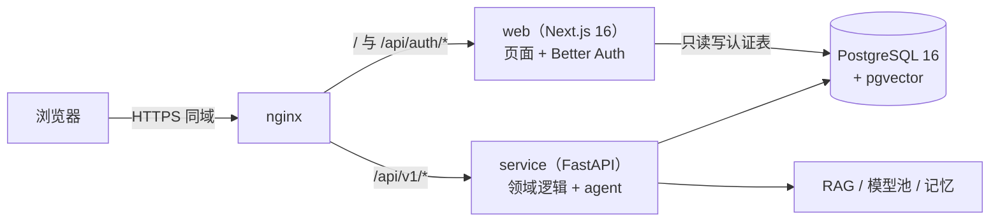
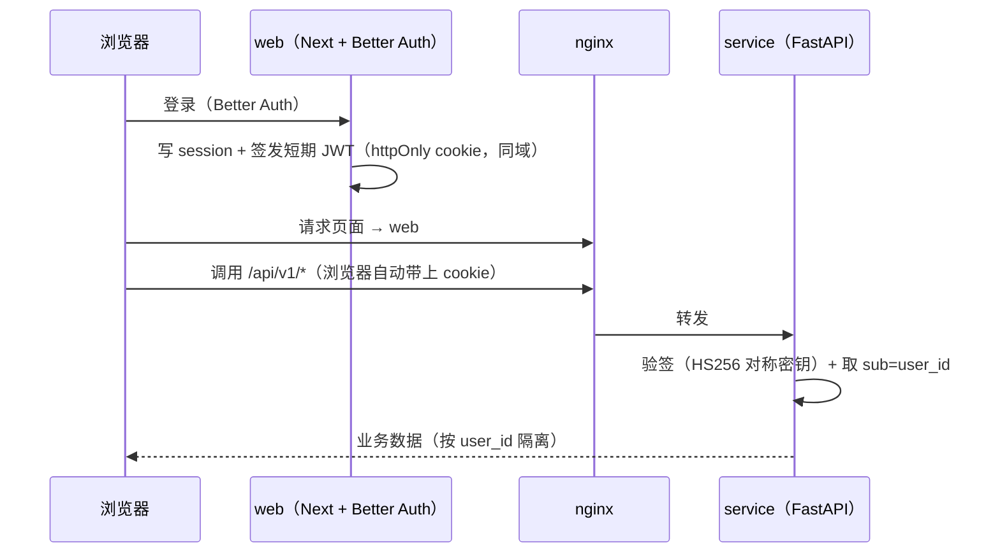
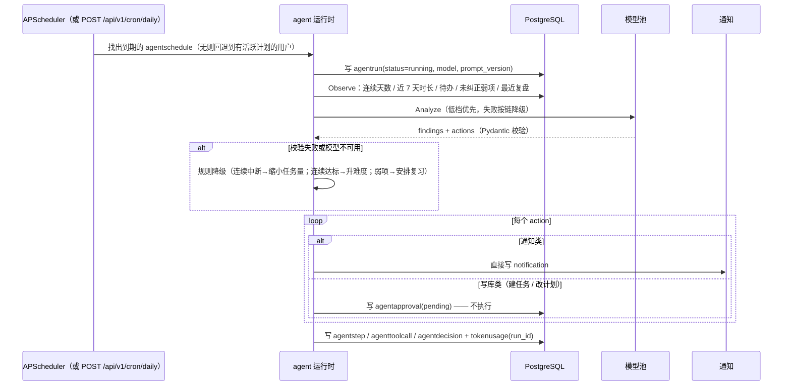
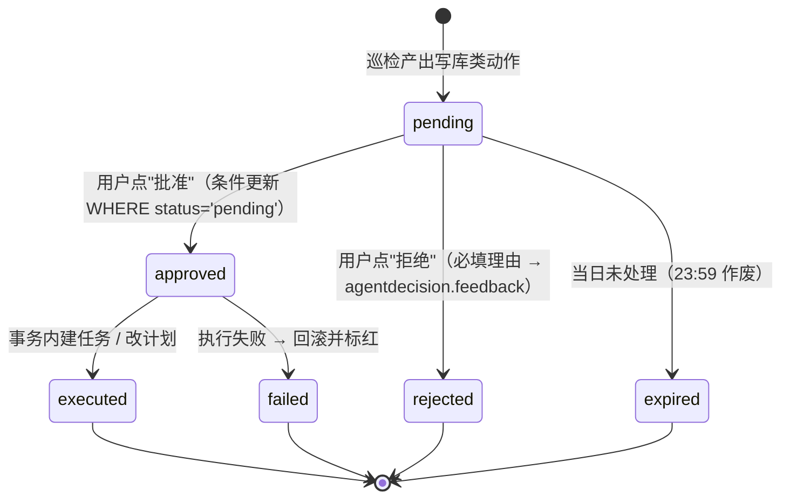
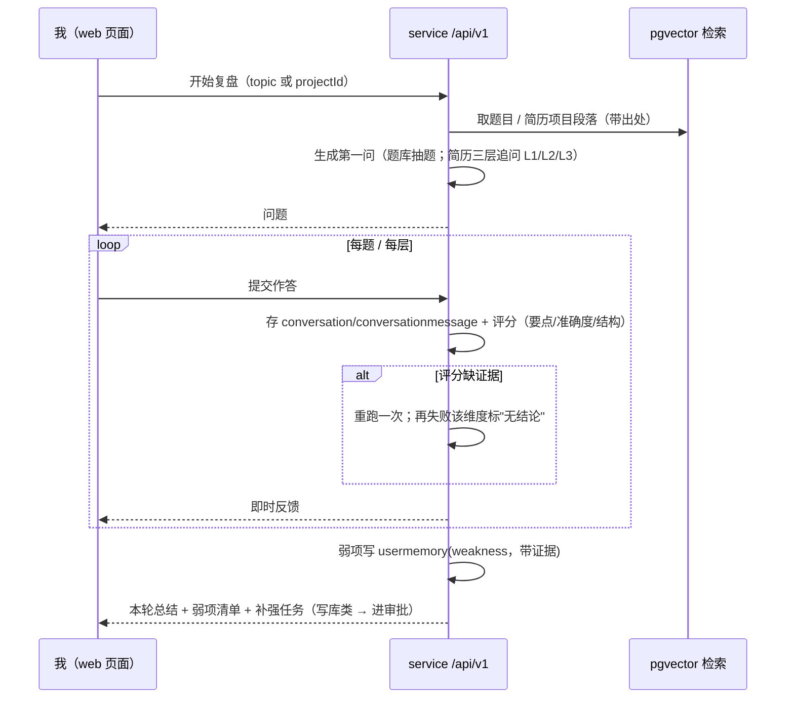
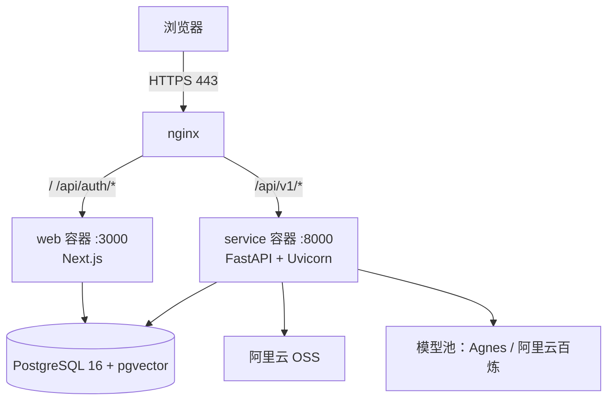

# 架构与技术方案

> 回答"怎么做"的第一份文档：技术栈、服务边界、认证、数据所有权、目录、关键流程、跨领域约定。**动手写任何代码之前先读这份。**
> 相关：`../PRD.md`（做什么）、`decisions/ADR-001-domain-service.md`（为什么是这套架构）、`README.md`（需求↔文档追溯表）。

## 0. 一句话

**两个服务、一个数据库**：Next.js 只做页面与登录（BFF），FastAPI 拥有数据与全部业务逻辑；nginx 在同一个域名下按路径把请求分流给两者。



## 1. 技术栈与版本

### 1.1 web（Next.js）

| 技术 | 版本 | 用途 |
|---|---|---|
| Node.js | 22（`node:22-alpine`） | 运行时 |
| Next.js | `16.2.10`（App Router） | 页面渲染 |
| React | `19.2.4` | UI |
| Tailwind CSS | v4 | 样式（无第三方 UI 库，组件用 `@base-ui/react` + shadcn CLI 生成） |
| Better Auth | `1.6.23` + Kysely adapter | 登录、会话、JWT 签发 |
| `react-markdown` 系列 / `three` / `gsap` / 自绘图表 | 见 `package.json` | 文档渲染、3D 岛、动效、统计图 |

### 1.2 service（FastAPI）

| 技术 | 版本 | 用途 |
|---|---|---|
| Python | 3.12 | 运行时（依赖装在 `service/.venv`，普通 venv + pip，可指定镜像源） |
| FastAPI | 0.11x | HTTP 层（契约、依赖注入、OpenAPI 自动生成） |
| Uvicorn | 最新稳定版 | ASGI 服务器（容器内单 worker，多实例横向扩展） |
| SQLAlchemy | 2.0（async）+ `asyncpg` | ORM，**schema 唯一所有者** |
| Alembic | 最新稳定版 | **唯一迁移工具**（31 张表的 DDL 由它管理） |
| APScheduler | 最新稳定版 | 每日巡检调度（同时暴露手动触发接口） |
| Pydantic | v2 | 请求/响应模型与校验 |
| httpx / openai SDK 兼容客户端 | — | 模型池调用 |
| pytest + pytest-asyncio | — | 单测 |
| ruff | — | lint + format |

> 版本以各自 `package.json` / `service/requirements*.txt` 为准，开工时锁定具体版本号。

### 1.3 基础设施

PostgreSQL 16 + pgvector（HNSW，`vector(1024)`）、nginx（TLS + 路径分流）、Docker Compose（web / service / db / nginx）、阿里云 ECS、OSS（预签名直传）。

## 2. 服务边界

**判据**：需要碰业务数据、需要跑 agent、需要被统计的，归 service；只在浏览器里发生的（渲染、交互、样式）归 web。

| 域 | 归属 | 说明 |
|---|---|---|
| 页面渲染、路由、样式、组件 | **web** | 15 个页面全部留在 web |
| 登录 / 注册 / 会话 / 令牌签发 | **web** | Better Auth；只读写 `user`/`session`/`account`/`verification` 四张表 |
| 所有业务接口 `/api/v1/*` | **service** | 打卡、计划、巡检、审批、题库、复盘、弱项、统计、成本、回归 |
| agent 巡检运行时 | **service** | Observe → Analyze → Plan → Execute，含模型池、记忆、通知 |
| RAG（题库与简历检索） | **service** | pgvector 查询与文档清洗入库 |
| 对象存储：图片预签名（头像 / 壁纸） | **service** | 密钥只留在后端服务；web 不持有云凭据 |
| 资料 / 题库文件上传 | **service** | 小文件直接 POST 给 service，由它解析入库，不绕 OSS 一圈 |
| 定时任务 | **service** | APScheduler；同时保留 `POST /api/v1/cron/daily` 供手动/CI 触发 |

**由此推出的一条硬结论**：Prisma 退场后，**web 不再直接读业务库**。打卡等"留在 web 的功能"指的是**页面留在 web**，其数据请求同样走 `/api/v1/*`。任何"web 直接查业务表"的做法都被禁止（见 §3 的数据所有权）。

## 3. 认证与数据所有权

### 3.1 认证链路（BFF + 短期 JWT）



- JWT 有效期 15 分钟，由 web 在会话有效期内续签；**service 不持有会话，也不需要访问认证表**。
- service 侧所有查询强制带 `user_id`；缺失或验签失败返回 `AUTH_REQUIRED`。

**验签方式已落定（R000）**：

| 项 | 决定 |
|---|---|
| 算法 | **HS256**（对称密钥，至少 32 字节） |
| 密钥分发 | **静态配置**：`JWT_SECRET` 存在环境变量，web 和 service 共用 |
| 签发方 | web 的 `/api/service-token`（`jose` 库） |
| 令牌传递 | httpOnly cookie `summer_service_jwt`；`Authorization: Bearer` **优先于** cookie（供 CLI/CI 覆盖） |
| 载荷 | 只放 `sub`（=`user.id`）、`email`、`iat`、`exp` |

**为什么用 HS256 而不是 RS256**：本项目只有一个签发方（web）和一个验签方（service），
对称密钥足够且更简单。RS256 的优势在于多个验签方可以共享公钥，但这个项目用不上。

- 服务间不互相调用（首期）：浏览器直接调 `/api/v1/*`，无需 BFF 转发，少一跳。

### 3.2 数据所有权

| 项 | 归属 |
|---|---|
| DDL / 迁移 | **Alembic**（service 侧）——**唯一**建表改表的地方，包含认证四张表 |
| ORM 模型 | SQLAlchemy 2.0（service） |
| 认证表的读写 | web 用 Better Auth + **Kysely**（薄 SQL 客户端，不产生迁移） |
| Prisma | **退场**：不搬 Prisma schema、不用 prisma migrate、不在 web 侧生成 Client |
| 数据库实例 | **空地新建**：不接管任何已有生产库（旧的 ECS 环境已不可用），由 Alembic 初始迁移从零建出 31 张表；本地与服务端都用容器里的 PostgreSQL 16 + pgvector |

**约束**（写进 CI / review 清单）：

1. 任何表的字段变更，先改 `service/alembic` 迁移，再同步 web 侧该表的类型定义；**不允许在 web 侧产生第二份 schema**。
2. 认证四张表的列名必须与 Better Auth 期望一致；升级 Better Auth 前先在测试库跑一次迁移演练。
3. 结构漂移检查：CI 里用 SQLAlchemy 模型与数据库对账（`alembic check` / 元数据 diff），发现未提交的模型改动即失败。

## 4. 目录结构（monorepo）

```
summer-checkin/
├── docs/                          文档（PRD + tech/）
├── web/                           Next.js：页面 + 认证
│   ├── src/app/                   页面路由（15 个页面）
│   ├── src/app/api/auth/…         Better Auth 路由（唯一保留的 Next API）
│   ├── src/components/            UI 组件
│   ├── src/lib/                   前端工具（auth 客户端、fetcher、格式化）
│   ├── public/ nginx 无关静态资源
│   └── package.json, next.config.ts, tsconfig.json, eslint.config.mjs, …
├── service/                       FastAPI：领域服务
│   ├── app/
│   │   ├── main.py                应用装配（路由、异常处理、CORS、requestId）
│   │   ├── api/v1/                接口层（薄：解析 → 校验 → 鉴权 → 调服务）
│   │   ├── core/                  config / security(JWT) / response / errors / logging
│   │   ├── db/                    engine、session、基类
│   │   ├── models/                SQLAlchemy 模型（31 张表）
│   │   ├── schemas/               Pydantic 出入参
│   │   ├── services/              域服务：checkin, plan, agent, review, quiz, stats, eval
│   │   └── agent/                 巡检运行时、模型池、记忆、RAG、通知
│   ├── alembic/                   迁移（唯一 DDL 来源）
│   ├── tests/                     pytest
│   └── pyproject.toml, Dockerfile, .env.example
├── infra/                         docker-compose.yml、nginx/*.conf、deploy.sh
└── .github/workflows/             CI（web 与 service 两条）
```

**不搬运**：`server/`（WS 聊天室 sidecar，见 `decisions/ADR-002`）、Prisma 相关文件。其余前端与脚本从参考项目 `summer-checkin-master/` 搬运，搬运时只调整路径与调用方式（不再直连数据库）。

## 5. 关键流程

### 5.1 每日巡检一轮（service 内）



### 5.2 审批状态机



并发点两次"批准"：第二次条件更新影响行数为 0 → 返回 `CONFLICT`，不重复执行。

### 5.3 一次复盘（题库 / 简历共用编排，均在 service）



## 6. 运行时与部署



- **同一个域名、同一份 cookie**：`/api/v1/*` 由 nginx 直达 service，浏览器无需知道有两个后端。
- **Docker 从 R000 起就要能跑**：`web/` 与 `service/` 各一份 Dockerfile，`infra/docker-compose.yml` 编排 web / service / db / nginx 四个容器（部署形态），`infra/docker-compose.dev.yml` 只起 db 供本地热重载开发；service 单 worker（agent 任务重、并发低），需要横向扩展时再拆调度。**部署形态与开发形态必须一致，晚做适配等于重做一遍。**
- **数据库跑在容器里**（本地与服务器同一镜像，带 pgvector 扩展）：不存在"连接某台已有服务器上的库"这种情况。
- **迁移在部署流程里显式执行**：`alembic upgrade head` 由部署脚本或一次性 job 运行，不在容器启动时隐式跑。
- **配置**：service 用 `SUMMER_` 前缀环境变量（`SUMMER_DATABASE_URL`、`SUMMER_JWT_SECRET`、`SUMMER_MODEL_*`…），web 沿用现有变量名（`BETTER_AUTH_*`、`DATABASE_URL`、`JWT_SECRET`、`OSS_*`），两者共用一份 `.env` 文件的不同段落。

## 7. 跨领域约定

### 7.1 统一响应与错误码（service 侧）

- 成功：`{"data": …}`；列表：`{"data": [...], "meta": {"nextCursor": "…"}}`
- 失败：`{"error": {"code": "…", "message": "…", "requestId": "…"}}`
- 错误码：`AUTH_REQUIRED` / `FORBIDDEN` / `NOT_FOUND` / `VALIDATION_FAILED` / `CONFLICT` / `RATE_LIMITED` / `QUOTA_EXCEEDED` / `UPSTREAM_FAILED` / `INTERNAL`
- 前端按 `code` 分支，中文文案由前端映射。

### 7.2 幂等

| 场景 | 机制 |
|---|---|
| 审批决策 | `agentapproval.status` 条件更新（`WHERE status='pending'`），影响 0 行 → `CONFLICT` |
| agent 工具执行 | `agenttoolcall.idempotency_key` 唯一约束 |
| 巡检重复触发 | 幂等键 = `(user_id, 日期, 动作类型)` |
| 客户端重试 | 写接口接受 `Idempotency-Key` 头 |

### 7.3 分页与限额

游标分页（`nextCursor`），默认 20、最大 100；限额与阈值见 `../PRD.md` 3.9。

### 7.4 日志与追踪

- 每个请求带 `X-Request-Id`（无则生成），nginx → service 透传，响应与日志都带；
- 服务端日志 `[域] 事件` 前缀；agent 每一步落库（`agentstep` / `agenttoolcall`），可回放；
- 两个服务都输出结构化日志，便于在同一处排查。

### 7.5 时间与版本

- 时间统一存 UTC，展示按本地时区；
- `agentrun` 记录 `model` 与 `prompt_version`（`名称@语义化版本`），是回归对比的可比性前提。

## 8. 分阶段落地（对应 PRD 的排期）

| 阶段 | 目标 | 完成标准 |
|---|---|---|
| W1 | `service/` 骨架 + Alembic 接管 31 张表 + nginx 分流 + JWT 验签 + `web/` 页面能跑 + 模型池**最小切片**（档位链/降级/记账）。**不含** agent 运行时、RAG 检索、记忆抽取、题库清洗（边界见 PRD 3.0.3） | 浏览器打开页面，`/api/v1/meta` 返回统一结构，端到端一条链路通；页面显示空态而不是白屏 |
| W2 | 巡检 + 审批迁到 service；web 页面改读 `/api/v1/*` | 每日巡检自动跑，审批能建任务 |
| W3 | 题库导入清洗 + 复盘（题库/简历）+ 统计 + 成本账本 | 一次完整闭环可用 |
| 之后 | 回归面板、HTTPS 上线、演示材料 | 见 PRD 4.1 |

## 9. 变更记录

| 日期 | 版本 | 变更 |
|---|---|---|
| 2026-09-25 | v0.1 | 首版：单栈 Next 分层架构 |
| 2026-09-25 | **v0.2** | **改为双服务**：FastAPI 拥有数据与业务逻辑，web 只做页面与认证（ADR-001）；Prisma 退场，Alembic 唯一迁移；目录改为 monorepo（`web/` + `service/` + `infra/`） |
