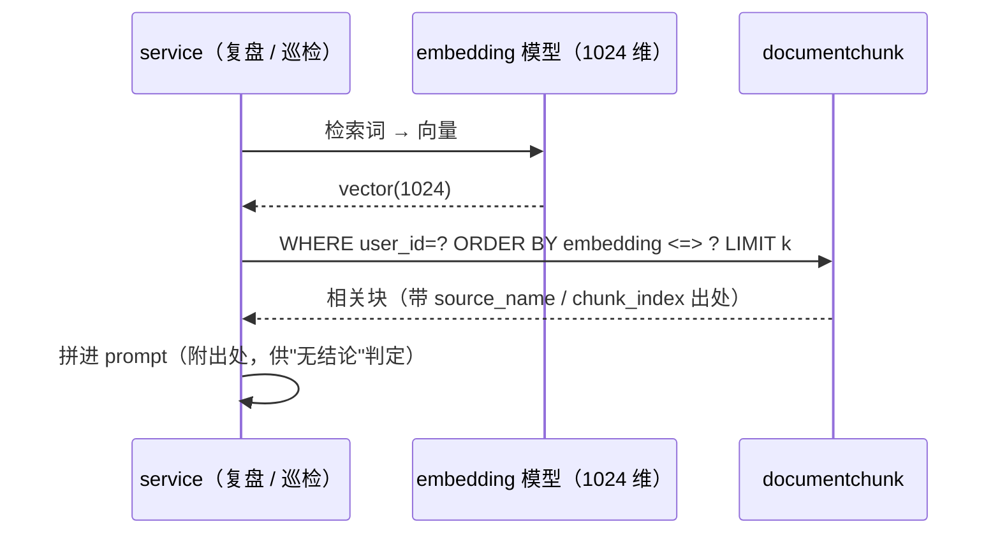

# 03 · 文档与知识库（向量检索）

> 4 张表：`document`、`documentchunk`、`knowledgedoc`、`documenttemplate`。
> **归属**：接口由 `service/` 提供（上传、清洗、检索）；页面在 `web/` 的"阅读 / 复盘 · 题库"。
> 本项目最关键的复用：**题库原文与简历正文都进 `knowledgedoc`，切块后进 `documentchunk`**——检索基础设施不动，只换内容与用法。

## 3.1 `document`

用户自己写的资料正文（Markdown），阅读页展示。

| 列 | 类型 | 默认 / 约束 | 说明 |
|---|---|---|---|
| `id` | text | PK | |
| `user_id` | text | NOT NULL → `user.id` CASCADE | |
| `title` | text | NOT NULL | |
| `content` | text | NOT NULL, `''` | Markdown 正文 |
| `created_at` | timestamptz | NOT NULL, `now()` | |
| `updated_at` | timestamptz | NOT NULL, `now()` | |

**索引**：`INDEX(user_id, updated_at)`。
**与 `knowledgedoc` 的分工**：`document` 是"给人看的正文"；`knowledgedoc` 是"给检索用的原文快照"。同一份资料可以两者都有。

## 3.2 `documentchunk`

**检索单元**：原文切块 + 1024 维向量，RAG 的读路径。

| 列 | 类型 | 默认 / 约束 | 说明 |
|---|---|---|---|
| `id` | text | PK | |
| `user_id` | text | NOT NULL → `user.id` CASCADE | 检索必须带 `user_id` 过滤，绝不跨用户 |
| `source_name` | text | NOT NULL | 来源标识，与 `knowledgedoc.source_name` 同值（如 `quiz:agent-basics`、`resume:project-a`） |
| `source_type` | text | NOT NULL, `'text'` | `text` / `pdf` / `docx` / `md` / `quiz` / `resume` |
| `chunk_index` | integer | NOT NULL | 在原文中的序号（重建时按它排序） |
| `content` | text | NOT NULL | 切块正文 |
| `embedding` | vector(1024) | **NOT NULL** | 写入即生成；生成失败则整条不入库（宁可少一条，也不留半条） |
| `created_at` | timestamptz | NOT NULL, `now()` | |

**索引**：`INDEX(user_id, source_name)`、`INDEX(source_name)`、`HNSW(embedding vector_cosine_ops)`。
**本项目用法**：题库按"一题一块"切（保留题号/答案标记），简历按"一项目一块 + 追问层级"切；检索查询固定形如
`SELECT ... FROM documentchunk WHERE user_id = :uid ORDER BY embedding <=> :q LIMIT :k`。

## 3.3 `knowledgedoc`

入库原文（每份资料一行），同时是"是否已导入"的去重依据。

| 列 | 类型 | 默认 / 约束 | 说明 |
|---|---|---|---|
| `id` | text | PK | |
| `user_id` | text | NOT NULL → `user.id` CASCADE | |
| `source_name` | text | NOT NULL | 来源标识，**唯一键的一部分** |
| `source_type` | text | NOT NULL | 与 `documentchunk.source_type` 同值 |
| `content` | text | NOT NULL | 清洗后的全文（Markdown） |
| `created_at` | timestamptz | NOT NULL, `now()` | |

**索引**：`UNIQUE(user_id, source_name)`、`INDEX(user_id)`。
**本项目用法**：
- 题库导入：`source_name = 'quiz:<主题>'`，重复导入同主题 → 走唯一键 `ON CONFLICT DO UPDATE`（先删旧 chunk 再重建）；
- 简历：`source_name = 'resume:<项目名>'`；
- 去重第二步：正文哈希相同的另一份资料直接跳过（哈希不落库，导入时现算对比）。

## 3.4 `documenttemplate`

资料模板（新建文档时可选）。

| 列 | 类型 | 默认 / 约束 | 说明 |
|---|---|---|---|
| `id` | text | PK | |
| `title` | text | NOT NULL | |
| `content` | text | NOT NULL, `''` | |
| `created_at` | timestamptz | NOT NULL, `now()` | |

**索引**：无。
**本项目用法**：保留；题库导入不用它（导入走 `knowledgedoc`）。

---

## 3.5 检索链路（读路径）

**硬约束**：链上的 embedding 模型必须输出 **1024 维**；`text-embedding-v2/v1` 是 1536 维，绝不放链上（维度不符会让整批写入失败）。

---

**变更记录**

| 日期 | 变更 |
|---|---|
| 2026-09-25 | 首版（4 张表全字段 + 检索链路） |
