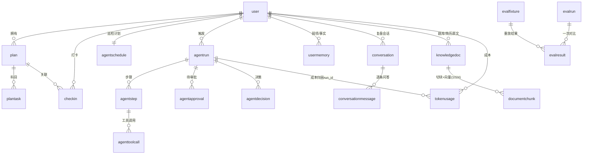

# 数据模型（总览）

> 31 张表（27 张沿用 + 4 张新增），**全部由 Alembic 拥有**：SQLAlchemy 2.0 模型定义在 `service/app/models/`，DDL 只从 `service/alembic/` 出来。
> 参考实现在 `summer-checkin-master/prisma/schema.prisma`（Prisma），本目录是它的重组与规范化版本——**字段名按本文档为准**。

## 1. 分册索引

| 分册 | 表 | 用途 |
|---|---|---|
| `01-account.md` | `user`、`session`、`account`、`verification`、`avatarchange` | 账号与会话（web 侧读写） |
| `02-study.md` | `plan`、`plantask`、`todo`、`checkin`、`studyrecord`、`plantemplate` | 学习计划与打卡 |
| `03-knowledge.md` | `document`、`documentchunk`、`knowledgedoc`、`documenttemplate` | 文档与知识库（向量检索） |
| `04-agent.md` | `agentrun`、`agentstep`、`agentapproval`、`agenttoolcall`、`agentdecision`、`agentschedule`、`usermemory`、`aihistory`、`notification` | agent 运行、审批、记忆、通知 |
| `05-conversation.md` | `conversation`、`conversationmessage`、`chatmessage` | 复盘会话与聊天室 |
| `06-usage-and-eval.md` | `tokenusage` + 新增 `evalfixture`、`evalrun`、`evalresult` | 成本账本与回归门禁 |

**31 = 27 + 4**：新增的是 `verification`（Better Auth 的邮箱验证表）与 `evalfixture` / `evalrun` / `evalresult`（回归门禁）。

> **关于 Better Auth 的表**：`user` / `session` / `account` / `verification` 四张表是 Better Auth 的运行前提，
> 但它们的 **DDL 仍由 Alembic 拥有**（不用 `better-auth migrate`）——两个 DDL 来源必然漂移。
> 字段名差异通过 Better Auth 的字段映射配置对齐（见 `01-account.md`）。

## 2. 命名与类型约定

**表名**：沿用现状——全小写、无下划线、单数（`user`、`plantask`、`agentrun`）。保留的原因：与参考实现一一对应，排查与搬运时不用做心智映射。

**列名**：**统一 snake_case**（`user_id`、`created_at`），与参考实现（camelCase）的差异是刻意的：

- 数据库是空地新建，没有历史包袱；
- Python 侧默认风格，省掉 PostgreSQL 大小写引号（`"userId"` 在每处 raw SQL、psql 排查、Alembic 自动生成里都要写引号）；
- Better Auth 侧通过字段映射对齐（`user.modelName` / `fields`），实现前按其文档确认一遍。

映射规则是机械的：`userId → user_id`、`createdAt → created_at`、`emailVerified → email_verified`。

**类型映射**（Prisma → PostgreSQL，本项目以右列为准）：

| 参考实现 | 本项目 | 说明 |
|---|---|---|
| `String` / `String?` | `text` / `text NULL` | 不定长；状态、类型、枚举值一律用 text，约束放应用层 |
| `Boolean` | `boolean NOT NULL DEFAULT false` | |
| `Int` | `integer` | |
| `Float` | `double precision` | 小时数、分数、权重 |
| `DateTime` | **`timestamptz`** | 比参考实现更严格：带时区、统一 UTC（见 `../architecture.md` §7.5） |
| `Json?` | `jsonb NULL` | agent 的输入输出、决策动作 |
| `String[]`（新增表） | `text[]` | fixture 标签 |
| `Decimal`（新增表） | `numeric(12,6)` | 成本金额 |
| `Unsupported("vector(1024)")` | `vector(1024)` | 见 §5 |

**主键**：全部 `id text PRIMARY KEY`，由应用侧生成 **UUIDv7 字符串**（时间有序，避免随机主键的索引碎片；参考实现用的 JS 侧 cuid 在 Python 没有等价官方实现）。对外仍是不透明字符串，前端不解析。

**外键删除行为**：与参考实现一致——用户相关的全部 `ON DELETE CASCADE`（除 `chatmessage.user_id` 与 `agentdecision.run_id` 为 `SET NULL`，见各分册）。

## 3. ER 图（主干）

## 4. 本项目新增用法（沿用表 → 新语义）

不改结构，只改用法——这是"复用而非新建"的关键：

| 表 | 新语义 |
|---|---|
| `knowledgedoc` | 除笔记/面经外，承载**题库原文**与**简历正文** |
| `documentchunk` | 题库与简历的检索单元（1024 维向量 + HNSW） |
| `conversation` / `conversationmessage` | **复盘会话**（题库一轮、简历一轮各一条会话） |
| `usermemory` | `type = weakness / correction` 承载**弱项档案**（带证据，跨轮次累积） |
| `agentrun` / `agentstep` / `agentapproval` / `agentdecision` / `agenttoolcall` | 每日巡检的完整轨迹、审批与决策理由 |
| `agentschedule` | 每日 21:00 巡检（`cron = "0 21 * * *"`） |
| `tokenusage` | 成本账本（新增 `run_id` 归因） |
| `checkin.subject` | 与题库主题、`plantask` 科目**对齐的同一个字符串**，让"学了什么"可被复盘引用 |

## 5. 向量与索引（pgvector）

- 扩展 `vector`（0.8.6），列 `vector(1024)`——与 embedding 模型输出维度绑定：**链上任何模型都必须输出 1024 维**（参考实现里 `text-embedding-v2/v1` 是 1536 维且忽略 `dimensions`，绝不能放进链上，否则整批写入失败）。
- HNSW 索引（余弦距离，对应查询的 `<=>`）：
  - `documentchunk_embedding_hnsw` on `documentchunk (embedding vector_cosine_ops)`
  - `usermemory_embedding_hnsw` on `usermemory (embedding vector_cosine_ops)`
- 参考实现踩过的坑（**新项目不能重演**）：embedding 曾存 `jsonb` + 应用层 JS 全量拉回算余弦，并有 `ORDER BY createdAt DESC LIMIT 1000` 的静默截断——超过窗口的文档永远搜不到且不报错。本项目从第一天就是 `vector` 列 + 数据库内排序 + `ORDER BY embedding <=> :q LIMIT k`。
- `documentchunk.embedding` 非空，`usermemory.embedding` **可空**（embedding 生成失败时留空，而不是让整条记忆丢失）。

## 6. Alembic 迁移策略

- **空地新建**：不接管任何已有库。初始迁移 `0001_initial` 从零建出 31 张表、扩展、索引。
- 迁移顺序：`CREATE EXTENSION vector` → 业务表 → `vector` 列 → HNSW 索引（`CREATE INDEX ... USING hnsw` 在数据为空时秒级完成）。
- 生成方式：手写模型后 `alembic revision --autogenerate`，**必须人工审阅**（自动生成认不出 `vector` 类型与 HNSW 索引，需要 `from sqlalchemy.dialects.postgresql import ...` + `op.execute("CREATE INDEX ... USING hnsw ...")`）。
- 守卫：CI 跑 `alembic upgrade head`（空库）→ `alembic check`（模型与库无漂移）→ `downgrade base` → 再 `upgrade head`（迁移可逆，至少到建表这一层）。
- 环境变量 `SUMMER_DATABASE_URL`；迁移**不在容器启动时隐式执行**，由部署脚本显式跑。

**autogenerate 的两条能力边界**（R000 实测确认，误判代价很高）：

| 边界 | 后果 | 应对 |
|---|---|---|
| **表/列改名检测不出来** | 渲染成 `drop_table` + `create_table`，照执行等于删数据 | 改名一律手写 `op.alter_column(..., new_column_name=...)` |
| **`compare_server_default` 默认关闭** | 改列默认值不会被 `alembic check` 发现 | 默认值变更需人工确认；必要时在 `env.py` 打开该项 |

另外 `CREATE EXTENSION vector`、`vector(1024)` 列、`USING hnsw` 索引三处 autogenerate 认不出来，必须手写在迁移里（`0001_initial` 就是这么来的）。

**测试库护栏**：`downgrade` 前必须确认库名以 `_test` 结尾（`app/db/guard.py`），否则拒绝执行。
开发与生产库名都不带此后缀，所以"手滑 downgrade 掉生产库"在代码层面被挡住。
例外通道 `SUMMER_ALLOW_NON_TEST_DB=1` 仅用于演练。

## 7. 数据保留与清理

| 数据 | 保留 | 清理方式 |
|---|---|---|
| `evalfixture` / `evalrun` / `evalresult` | 永久（这是回归基线） | 手动删无用样本 |
| `tokenusage` 明细 | 90 天 | 每日任务按 `created_at` 删除；聚合指标（按日/按 surface）永久保留在统计查询中（先聚合再删） |
| `agentrun` 及其 steps/toolcalls | 90 天 | 同上；被固化成 fixture 的 run 不删（`evalfixture.source_run_id` 引用） |
| `notification` 已读 | 30 天 | 沿用参考实现逻辑 |
| 进行中的 `conversation` | 7 天未更新 | 复盘会话中断保留 7 天，之后可清理 |
| `checkin` / `studyrecord` / `usermemory` / `knowledgedoc` | 永久 | 学习与弱项是长期资产，不清理 |

## 8. 变更记录

| 日期 | 版本 | 变更 |
|---|---|---|
| 2026-09-25 | v0.1 | 首版：30 张表分册、命名与类型约定、ER 图、向量索引、迁移与保留策略 |
| 2026-09-27 | v0.2 | R000 落地：30 → **31 张表**（补 `verification`）、autogenerate 两条能力边界、测试库护栏 |
